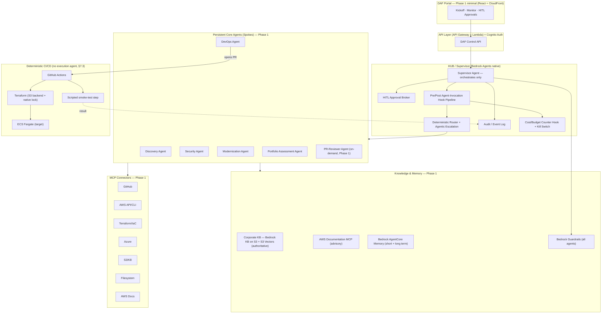
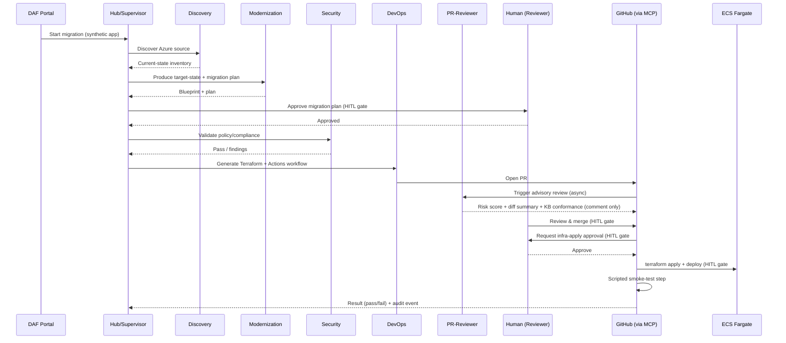
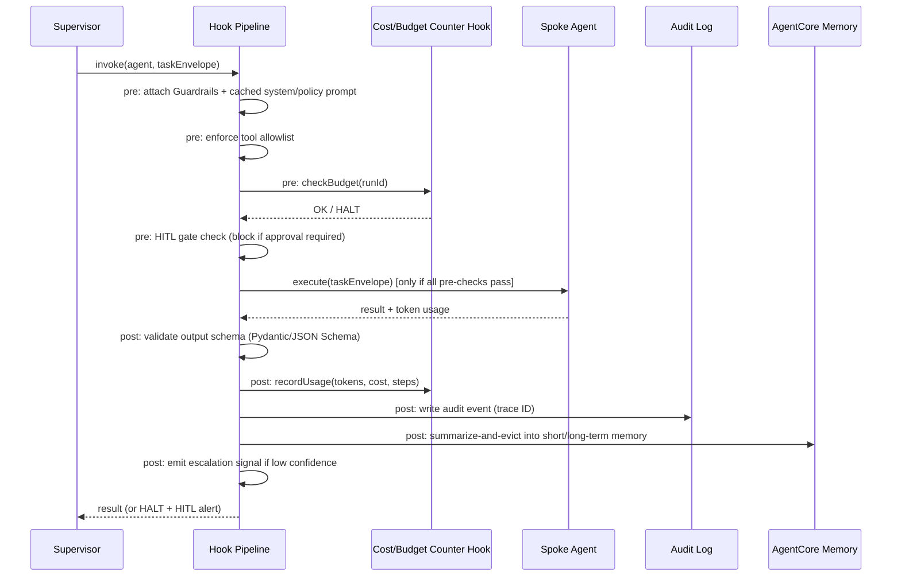

# Design Document: DAF Phase 1 — Foundations & Single-App Validation

**Source of truth:** [`_dev-analysis/DAF_Solution_Design.md`](../../../_dev-analysis/DAF_Solution_Design.md) — this document scopes that design down to the **Phase 1** buildable increment only. Decisions already settled in the source document are carried forward as-is and are **not** re-litigated here: deterministic-first execution (no Migration Worker / agentic Testing agent in Phase 1), **S3 Vectors** as the Phase 1 KB vector backend, **S3-native Terraform state locking**, **GitHub OIDC federation** for CI/CD → AWS auth, the **Cost/Budget Counter Hook** (deterministic mechanism, not the Phase 2 Cost/FinOps Agent), and the **PR-Reviewer Agent** as a Phase 1 advisory layer.

Notation style for this document: **Structured Pseudocode** (`PROCEDURE`/`SEQUENCE`/`IF-THEN-ELSE` blocks in ```pascal fences), per user selection.

## Overview

Phase 1 builds the smallest working slice of DAF that proves the hub-spoke multi-agent pattern end-to-end: a Bedrock-native Supervisor routes tasks to five persistent spoke agents (Discovery, DevOps, Security, Modernization, Portfolio Assessment) plus one Phase-1 on-demand agent (PR-Reviewer), backed by a Bedrock Knowledge Base (S3 + S3 Vectors), Bedrock AgentCore Memory, and Bedrock Guardrails. The validation scenario is a real migration of a synthetic app from Azure to ECS Fargate, executed through a **deterministic CI/CD path** (agents author, GitHub Actions executes) rather than an agentic execution worker. Seven HITL gates, a Cost/Budget Counter Hook (hard caps + kill switch), distributed tracing, and durable/resumable run state make the system safe to operate even though it is agentic.

This document details what Phase 1 actually needs to be implemented: the component boundaries and interfaces (high-level), and the core control-flow algorithms — model routing, the pre/post agent-invocation hook pipeline, the Cost/Budget Counter Hook's threshold checks, and the HITL gate state machine (low-level) — that the source document describes at the policy level but does not yet express as implementable logic.

## Architecture

Phase 1 architecture is a subset of the full DAF architecture in the source document (§3): it excludes Phase 2/3 on-demand workers (Migration Worker, Testing/Validation Agent, Cost/FinOps Agent, KB-Curator) and excludes the OpenSearch Serverless vector backend, VPC/PrivateLink isolation, and sandboxed code execution (all Phase 2+, source §12.5–12.6, §13).



**Star rule (unchanged from source §3):** every agent-to-agent handoff is brokered by the Supervisor. Spokes reach tools via MCP and knowledge via Bedrock KB/AgentCore directly (not through the Hub), but never hand off to another spoke directly.

**Phase 1 scope boundary vs. source document:**

| In scope (Phase 1) | Out of scope (Phase 2/3, unchanged from source §13) |
|---|---|
| Hub/Supervisor, 5 persistent core agents, PR-Reviewer Agent | Migration Worker, Testing/Validation Agent, Cost/FinOps Agent, KB-Curator |
| Bedrock KB on S3 + S3 Vectors | OpenSearch Serverless backend |
| AgentCore Memory (short + long term) | Advanced eviction/compaction tuning |
| Deterministic CI/CD execution (GitHub Actions) | Sandboxed agent-code execution (ephemeral Fargate/CodeBuild sandbox) |
| Minimal portal (kickoff, monitor, approvals) | Full portal (KB mgmt, blueprint viewer, cost dashboard, audit trail UI) |
| Cost/Budget Counter Hook (deterministic caps + kill switch) | Full Cost/FinOps Agent (modeling, AWS Budgets, anomaly reasoning) |
| Single account, single region, AU-CRIS | Cross-account compute, VPC/PrivateLink, multi-tenancy |

## Sequence Diagrams

### Main flow: synthetic app migration (Azure → ECS Fargate)

Unchanged from source §7 sequence diagram, reproduced here as the Phase 1 target flow:



### Pre/post agent-invocation hook pipeline (per spoke call)



## Components and Interfaces

### Component 1: Hub / Supervisor

**Purpose:** Orchestrates only — task decomposition, deterministic routing, HITL brokering, audit. Never performs migration work itself (source §2 principle #1, §11).

**Interface:**
```pascal
INTERFACE Supervisor
  PROCEDURE startRun(runConfig: RunConfig) RETURNS RunHandle
  PROCEDURE routeTask(task: Task, runId: RunId) RETURNS TaskResult
  PROCEDURE requestHitlApproval(gate: HitlGateType, context: ApprovalContext) RETURNS ApprovalDecision
  PROCEDURE killRun(runId: RunId, reason: String) RETURNS Void
  PROCEDURE getRunStatus(runId: RunId) RETURNS RunStatus
END INTERFACE
```

**Responsibilities:**
- Decompose an incoming run (e.g. "migrate synthetic app") into a task graph across the 5 core agents.
- Invoke the Deterministic Router (below) for every task before dispatch.
- Own the HITL Approval Broker and Audit/Event Log.
- Own the Cost/Budget Counter Hook and global kill switch (source §12.1).
- Never call MCP tools or cloud APIs directly — only spokes do.

### Component 2: Deterministic Router + Agentic Escalation

**Purpose:** Implements the routing model from source §5.3–§5.4: fixed `task-type → model` policy by default, agentic escalation only on low confidence / failure.

**Interface:**
```pascal
INTERFACE Router
  PROCEDURE resolveModel(taskType: TaskType, attemptState: AttemptState) RETURNS ModelTier
  PROCEDURE recordOutcome(taskId: TaskId, tier: ModelTier, confidence: Float, succeeded: Boolean) RETURNS Void
END INTERFACE
```

Full algorithm in [Algorithmic Pseudocode](#algorithmic-pseudocode) below.

### Component 3: Cost/Budget Counter Hook

**Purpose:** Deterministic (non-agentic) mechanism enforcing per-run hard caps and gating Opus escalation, per source §12.1 and §5.4. Explicitly **not** the Phase 2 Cost/FinOps Agent — no modeling or forecasting, just counting and threshold checks.

**Interface:**
```pascal
INTERFACE CostBudgetHook
  PROCEDURE preCheck(runId: RunId, estimatedTokens: Integer) RETURNS BudgetDecision
  PROCEDURE recordUsage(runId: RunId, agentId: AgentId, tokensIn: Integer, tokensOut: Integer, wallClockMs: Integer) RETURNS Void
  PROCEDURE getRunCounters(runId: RunId) RETURNS RunCounters
  PROCEDURE checkOpusGate(runId: RunId) RETURNS OpusGateDecision
  PROCEDURE triggerCircuitBreaker(runId: RunId, agentId: AgentId, reason: String) RETURNS Void
END INTERFACE
```

Full algorithm in [Algorithmic Pseudocode](#algorithmic-pseudocode) below.

### Component 4: HITL Approval Broker

**Purpose:** Implements the 7 HITL gates from source §8 as an explicit state machine, surfaced to the portal, every decision written to the audit log.

**Execution mechanism (Phase 1):** A gate wait is a durable, long-lived pause (hours/days), and the hook pipeline runs on Lambda, which cannot hold a blocking call open for that duration. The broker resolves this narrowly with **AWS Step Functions**, scoped *only* to brokering the HITL wait/resume itself (`raiseGate` starts an execution that pauses on the "wait for task token" pattern; `decide` calls `SendTaskSuccess`/`SendTaskFailure` against the held token to resume it). This is a narrow, single-purpose use of Step Functions — it is not a general orchestration replacement, and it does not reopen or change the existing decision that durable run state (`RunState`, `RunCounters`, `GateTicket`) is persisted in DynamoDB (source §12.3); that persistence model is unchanged. Step Functions here exists solely to hold the "someone needs to wake this pipeline up later" concern that a stateless Lambda cannot hold on its own.

**Interface:**
```pascal
INTERFACE HitlBroker
  PROCEDURE raiseGate(gate: HitlGateType, runId: RunId, context: ApprovalContext) RETURNS GateTicketId
  PROCEDURE decide(ticketId: GateTicketId, decision: ApprovalDecision, approver: UserId) RETURNS Void
  PROCEDURE getPendingGates(runId: RunId) RETURNS List<GateTicket>
END INTERFACE
```

Full state machine in [Algorithmic Pseudocode](#algorithmic-pseudocode) below.

### Component 5: Persistent Core Agents (Discovery, DevOps, Security, Modernization, Portfolio Assessment)

**Purpose:** Unchanged responsibilities from source §4 (Agent Catalog). Each is a Bedrock Agent with its own least-privilege IAM role (source §12.4), receives a task envelope (not full history, source §6.4), and returns a structured result + confidence signal.

**Common interface (all core agents implement this contract):**
```pascal
INTERFACE SpokeAgent
  PROCEDURE execute(envelope: TaskEnvelope) RETURNS SpokeResult
END INTERFACE

STRUCTURE TaskEnvelope
  task: String
  inputs: Map<String, ArtifactRef>
  acceptanceCriteria: List<String>
  traceId: TraceId
END STRUCTURE

STRUCTURE SpokeResult
  output: ArtifactRef
  confidence: Float          // 0.0–1.0, drives escalation decisions
  tokensUsed: TokenUsage
  status: SUCCESS | PARTIAL | FAILED
  notes: String
END STRUCTURE
```

| Agent | Default model (source §4) | Primary tools (MCP) |
|---|---|---|
| Discovery | Sonnet 5 (reason) / Haiku (collect) | Azure MCP, Filesystem |
| DevOps | Haiku (exec), Sonnet on escalation | GitHub MCP, Terraform MCP, AWS API/CLI MCP |
| Security | Sonnet 5 | AWS API/CLI MCP, S3/KB MCP |
| Modernization | Sonnet 5 | AWS Docs MCP, S3/KB MCP, Filesystem |
| Portfolio Assessment | Sonnet 5 | S3/KB MCP |
| PR-Reviewer (on-demand) | Haiku (Sonnet on complex diffs) | GitHub MCP (read-only) |

### Component 6: Deterministic CI/CD path (no execution agent)

**Purpose:** Executes the migration deterministically per source §7.3. Not an agent — GitHub Actions + Terraform + a scripted smoke-test step.

**Interface (CI pipeline contract, not an agent API):**
```pascal
INTERFACE DeploymentPipeline
  PROCEDURE onPrMerged(prId: PrId) RETURNS Void          // triggers plan+apply after HITL gate #1
  PROCEDURE runSmokeTest(deployTarget: DeployTarget) RETURNS SmokeTestResult
  PROCEDURE reportResult(runId: RunId, result: SmokeTestResult) RETURNS Void  // back to Hub audit log
END INTERFACE
```

## Data Models

### Model 1: RunConfig / RunState

```pascal
STRUCTURE RunConfig
  runId: RunId
  targetApp: String            // synthetic app identifier
  sourceEnv: AzureSourceRef
  targetPlatform: ECS_FARGATE | EKS | AZURE   // Phase 1 = ECS_FARGATE only
  budgetCeiling: BudgetCeiling
END STRUCTURE

STRUCTURE RunState
  runId: RunId
  status: PENDING | RUNNING | HALTED | AWAITING_HITL | COMPLETED | FAILED
  taskGraph: List<TaskNode>       // durable, persisted per §12.3
  currentStepIndex: Integer
  traceId: TraceId
  counters: RunCounters          // see Cost/Budget Counter Hook
  createdAt: Timestamp
  updatedAt: Timestamp
END STRUCTURE
```

**Validation rules:**
- `runId` is unique and immutable once created.
- `targetPlatform` restricted to `ECS_FARGATE` in Phase 1 (EKS/Azure are Phase 2 per source §13).
- `taskGraph` must be persisted to DynamoDB after every state transition (idempotent write, keyed by `runId + stepIndex`) — this is what makes a run resumable per source §12.3.

### Model 2: RunCounters (backs the Cost/Budget Counter Hook)

```pascal
STRUCTURE RunCounters
  runId: RunId
  totalTokensIn: Integer
  totalTokensOut: Integer
  totalWallClockMs: Integer
  totalSteps: Integer
  opusInvocations: Integer
  estimatedCostUsd: Float
END STRUCTURE

STRUCTURE BudgetCeiling
  maxTotalTokens: Integer
  maxCostUsd: Float
  maxWallClockMs: Integer
  maxSteps: Integer
  maxOpusInvocations: Integer     // source §5.4: "max 1-2 calls per run"
END STRUCTURE
```

**Validation rules:**
- All counters are monotonically increasing within a run; never decremented.
- `BudgetCeiling` values are hardcoded config in Phase 1 (source §14 open item: "per-run hard-cap values to be set once baseline usage is observed") — not derived or learned.

### Model 3: HitlGateTicket

```pascal
STRUCTURE GateTicket
  ticketId: GateTicketId
  runId: RunId
  gateType: HitlGateType     // one of the 7 gates, source §8
  status: PENDING | APPROVED | REJECTED | EXPIRED
  context: ApprovalContext   // artifact refs + summary for the human
  raisedAt: Timestamp
  decidedAt: Timestamp
  approver: UserId
  stepFunctionsTaskToken: String   // held task token for the paused wait-for-task-token execution (Phase 1 mechanism, see Component 4)
END STRUCTURE

ENUM HitlGateType
  INFRA_APPLY            // gate 1
  PR_MERGE                // gate 2
  DESTRUCTIVE_ACTION      // gate 3
  WORKER_SPINUP           // gate 4
  KB_WRITE                // gate 5
  PLAN_FINALIZE           // gate 6
  CLOUD_DEPLOY            // gate 7
END ENUM
```

**Validation rules:**
- A ticket in `PENDING` sets `RunState.status ← AWAITING_HITL` for the **whole run** (Phase 1 is run-level blocking, matching Requirement 5.3 and the `raiseGate`/`decide` implementation below) — Phase 1's task graph is effectively linear per run, so this is not a practical limitation yet. True per-task-only blocking within a multi-branch task graph (where unrelated branches could keep progressing while one branch awaits a gate) is deferred to Phase 2.
- Every `decide()` call is written to the audit log with `ticketId`, `approver`, `decidedAt` — no silent approvals.
- Phase 1 has no approval-expiry/timeout policy yet (source §14 open item, deferred to Phase 2) — `EXPIRED` status exists in the model for forward compatibility but is not populated by any Phase 1 logic.

### Model 4: TaskEnvelope / ArtifactRef (context/token strategy, source §6.4)

```pascal
STRUCTURE ArtifactRef
  artifactId: String
  location: S3_URI | DYNAMODB_KEY
  kind: SOURCE_TREE | BLUEPRINT | TF_PLAN | INVENTORY | OTHER
END STRUCTURE
```

**Validation rules:**
- Large artifacts (source tree, blueprint, tf plan) are never inlined into a `TaskEnvelope` — always passed by `ArtifactRef`, per source §6.4 point 1.

## Algorithmic Pseudocode

### Algorithm 1: Deterministic Router + Agentic Escalation

Implements source §5.2–§5.4 (task→model policy table, escalation ladder Haiku→Sonnet→Opus).

```pascal
ALGORITHM resolveModel(taskType, attemptState)
INPUT: taskType of type TaskType, attemptState of type AttemptState
OUTPUT: tier of type ModelTier

BEGIN
  // Step 1: deterministic default lookup (source §5.2 table)
  defaultTier ← TASK_MODEL_POLICY[taskType]
  ASSERT defaultTier ≠ NULL   // every task type must be in the policy table

  IF attemptState.attemptNumber = 1 THEN
    RETURN defaultTier
  END IF

  // Step 2: agentic escalation — only entered on retry (attemptNumber > 1)
  ASSERT attemptState.lastConfidence < CONFIDENCE_THRESHOLD
       OR attemptState.lastStatus = FAILED

  IF defaultTier = HAIKU THEN
    RETURN SONNET   // escalate once, logged (source §5.4 ladder)
  END IF

  IF defaultTier = SONNET THEN
    IF attemptState.attemptNumber > MAX_SONNET_RETRIES THEN
      // Step 3: Opus is gated — never a silent default
      gateDecision ← checkOpusGate(attemptState.runId)
      IF gateDecision = ALLOWED THEN
        RETURN OPUS
      ELSE
        // Opus budget exhausted for this run (pure budget cap in Phase 1, see checkOpusGate): halt, do not silently degrade
        RAISE RunHalt("Opus escalation blocked: " + gateDecision.reason)
      END IF
    ELSE
      RETURN SONNET   // retry at same tier before escalating further
    END IF
  END IF

  // Already at Opus and still failing: no further ladder — halt and alert
  RAISE RunHalt("Opus tier exhausted for task " + attemptState.taskId)
END
```

**Preconditions:**
- `TASK_MODEL_POLICY` fully covers every `TaskType` in the system (no fallthrough — source §5.2 table must be exhaustive at deploy time).
- `attemptState.attemptNumber` starts at 1 and increments only on a retry of the *same* task.

**Postconditions:**
- Every call returns exactly one `ModelTier`, or raises `RunHalt` (never silently returns a tier the caller didn't ask to escalate to).
- Every escalation (Haiku→Sonnet, Sonnet→Opus) is logged by the caller (Hub) with `taskId`, `fromTier`, `toTier`, `reason` — enforced by convention at the call site, not inside this pure function.

**Loop Invariants:** N/A — no loop; escalation is a bounded ladder of at most 2 hops per task, driven by `attemptState.attemptNumber` supplied by the caller's retry loop.

### Algorithm 2: Cost/Budget Counter Hook — threshold checks

Implements source §12.1 (hard caps, kill switch) and §5.4 (Opus gate).

```pascal
ALGORITHM preCheck(runId, estimatedTokens)
INPUT: runId of type RunId, estimatedTokens of type Integer
OUTPUT: decision of type BudgetDecision

BEGIN
  IF isKillSwitchActive(runId) THEN
    RETURN BudgetDecision(HALT, "kill switch active")
  END IF

  counters ← getRunCounters(runId)
  ceiling ← getRunConfig(runId).budgetCeiling

  IF counters.totalTokensIn + counters.totalTokensOut + estimatedTokens > ceiling.maxTotalTokens THEN
    RETURN BudgetDecision(HALT, "token ceiling exceeded")
  END IF

  // Cost is projected the same way tokens are: current + estimated-for-this-call, compared to the
  // ceiling, so a single expensive call cannot slip past the ceiling before the next preCheck.
  estimatedCostForCall ← estimateCostUsd(estimatedTokens)
  IF counters.estimatedCostUsd + estimatedCostForCall > ceiling.maxCostUsd THEN
    RETURN BudgetDecision(HALT, "cost ceiling exceeded")
  END IF

  // Wall-clock is intentionally boundary-only (current elapsed time vs. ceiling), not projected:
  // unlike tokens/cost, the duration of the upcoming call is not knowable in advance of executing it,
  // so there is no equivalent "current + estimated" projection available here. This means a single
  // long-running call can still push totalWallClockMs past the ceiling before the *next* preCheck
  // catches it — an accepted asymmetry versus the token/cost checks, not an oversight.
  IF counters.totalWallClockMs > ceiling.maxWallClockMs THEN
    RETURN BudgetDecision(HALT, "wall-clock ceiling exceeded")
  END IF

  IF counters.totalSteps + 1 > ceiling.maxSteps THEN
    RETURN BudgetDecision(HALT, "step ceiling exceeded")
  END IF

  RETURN BudgetDecision(OK, "")
END
```

```pascal
ALGORITHM checkOpusGate(runId)
INPUT: runId of type RunId
OUTPUT: decision of type OpusGateDecision

BEGIN
  // Phase 1 simplification (intentional, not an oversight — see note below): the Opus gate is a
  // PURE budget cap. Source §5.4 frames escalation as "requires HITL approval OR stays within
  // budget" — Phase 1 narrows this to "stays within budget" only, because Phase 1 has no dedicated
  // Opus/cost-escalation gate type among the 7 HITL gates (source §8), and reusing DESTRUCTIVE_ACTION
  // as a proxy (the original approach) conflated two distinct human decisions in the audit trail.
  // A HITL-override path — letting an approved human decision grant an extra Opus call beyond the
  // count cap — is deferred to Phase 2, where a dedicated gate type can be added without overloading
  // an unrelated gate's semantics.
  counters ← getRunCounters(runId)
  ceiling ← getRunConfig(runId).budgetCeiling

  IF counters.opusInvocations < ceiling.maxOpusInvocations THEN
    RETURN OpusGateDecision(ALLOWED, "")
  END IF

  RETURN OpusGateDecision(DENIED, "opus budget exhausted for this run")
END
```

```pascal
ALGORITHM recordUsage(runId, agentId, tokensIn, tokensOut, wallClockMs)
INPUT: runId, agentId, tokensIn, tokensOut, wallClockMs
OUTPUT: Void

BEGIN
  // Idempotency: caller supplies a per-invocation idempotency key (source §12.3);
  // duplicate recordUsage for the same key is a no-op.
  ASSERT NOT alreadyRecorded(runId, agentId, currentInvocationKey())

  ATOMICALLY UPDATE RunCounters[runId]:
    totalTokensIn ← totalTokensIn + tokensIn
    totalTokensOut ← totalTokensOut + tokensOut
    totalWallClockMs ← totalWallClockMs + wallClockMs
    totalSteps ← totalSteps + 1
    estimatedCostUsd ← estimatedCostUsd + computeCost(agentId, tokensIn, tokensOut)

  LOG_STRUCTURED("usage_recorded", runId, agentId, tokensIn, tokensOut)

  // Circuit breaker: two distinct triggers feed one mechanism (source §12.1). Both are checked
  // here, independently, and either can trip the same triggerCircuitBreaker() action for the agent.
  IF detectRepeatedNoProgress(runId) THEN
    triggerCircuitBreaker(runId, agentId, "repeated identical tool calls, no forward progress")
  END IF

  IF detectConsecutiveFailures(runId, agentId) THEN
    triggerCircuitBreaker(runId, agentId, "N consecutive failures for this agent")
  END IF
END
```

**Preconditions:**
- `recordUsage` is called exactly once per completed agent invocation, post-invocation hook only (never pre).
- `getRunConfig(runId).budgetCeiling` is set at run creation and immutable for the run's lifetime.

**Postconditions:**
- `preCheck` never mutates state — pure read + decision (safe to call speculatively).
- Breaching any ceiling in `preCheck` returns `HALT` and the caller (hook pipeline) must raise a HITL alert, not silently continue (source §12.1: "not a silent continue").
- `recordUsage` updates are atomic per run (no lost updates under concurrent spoke calls within the same run).

**Loop Invariants:** N/A (no loops; `detectRepeatedNoProgress` is a bounded lookback over the last N recorded steps for this `runId`, and `detectConsecutiveFailures` is a bounded per-agent counter — neither is an unbounded scan).

### Algorithm 3: HITL Gate state machine

Implements source §8 (7 gates) as an explicit state machine, brokered by the Hub.

```pascal
ALGORITHM raiseGate(gate, runId, context)
INPUT: gate of type HitlGateType, runId of type RunId, context of type ApprovalContext
OUTPUT: ticketId of type GateTicketId

BEGIN
  ticket ← NEW GateTicket(
    ticketId: generateId(),
    runId: runId,
    gateType: gate,
    status: PENDING,
    context: context,
    raisedAt: now()
  )

  // Phase 1 execution mechanism (Component 4): start a Step Functions execution that immediately
  // pauses using the "wait for task token" pattern. The task token is the durable handle that lets
  // decide() resume this exact paused execution later, without any Lambda holding a blocking call open.
  ticket.stepFunctionsTaskToken ← StepFunctions.startExecutionAndWaitForTaskToken(gate, runId, ticket.ticketId)

  PERSIST ticket   // DynamoDB, keyed by ticketId (source §12.3 checkpointing) — unchanged; Step Functions
                    // is only the wait/resume mechanism, not a replacement for this persistence.

  RunState[runId].status ← AWAITING_HITL
  NOTIFY_PORTAL(ticket)         // surfaced in portal per source §9
  AUDIT_LOG.write("hitl_gate_raised", ticket)

  RETURN ticket.ticketId
END
```

```pascal
ALGORITHM decide(ticketId, decision, approver)
INPUT: ticketId, decision of type APPROVED | REJECTED, approver of type UserId
OUTPUT: Void

BEGIN
  ticket ← LOAD GateTicket(ticketId)
  ASSERT ticket.status = PENDING   // no double-deciding a resolved ticket

  ticket.status ← decision
  ticket.decidedAt ← now()
  ticket.approver ← approver
  PERSIST ticket

  AUDIT_LOG.write("hitl_gate_decided", ticket)   // 100% traceability, source §12.2

  IF decision = APPROVED THEN
    RunState[ticket.runId].status ← RUNNING
    // Resume the paused Step Functions execution holding ticket.stepFunctionsTaskToken; this is what
    // wakes the hook pipeline (Algorithm 4) back up — replaces the earlier abstract "RESUME task
    // blocked on ticket.ticketId" with the concrete mechanism.
    StepFunctions.sendTaskSuccess(ticket.stepFunctionsTaskToken, result: APPROVED)
  ELSE
    RunState[ticket.runId].status ← HALTED
    StepFunctions.sendTaskFailure(ticket.stepFunctionsTaskToken, reason: "HITL gate rejected: " + ticket.gateType)
    NOTIFY_PORTAL("run halted: gate " + ticket.gateType + " rejected")
  END IF
END
```

**Preconditions:**
- Every one of the 7 `HitlGateType` values (source §8) has at least one call site in the Hub/pipeline that calls `raiseGate` before the corresponding state-changing action — this is a completeness requirement on the implementation, not just the model.
- `decide()` is only reachable by an authenticated portal user (Cognito, source §9); Phase 1 has no per-gate RBAC yet (source §14 open item, deferred to Phase 2) — any authenticated user may decide any gate in Phase 1.

**Postconditions:**
- A `PENDING` ticket blocks exactly the task/run path that raised it; `RunState.status` accurately reflects `AWAITING_HITL` while any ticket for that run is `PENDING`.
- Rejection halts the run (source: gates protect state-changing boundaries — a rejection must not be treated as "proceed anyway").
- Every gate decision is durably persisted and audit-logged before the blocked task resumes (ordering matters for the resumability guarantee in source §12.3).

**Loop Invariants:** N/A — single-transition state machine per ticket (`PENDING → APPROVED|REJECTED|EXPIRED`, no cycles).

### Algorithm 4: Pre/Post Agent-Invocation Hook Pipeline

Implements source §7.2 point 2 ("Agent lifecycle hooks — Hub-enforced, the linchpin") as an explicit pipeline composing Algorithms 1–3.

```pascal
ALGORITHM invokeSpoke(agent, envelope, runId)
INPUT: agent of type SpokeAgent, envelope of type TaskEnvelope, runId of type RunId
OUTPUT: result of type SpokeResult

BEGIN
  // ---- PRE-INVOCATION ----
  attachGuardrails(envelope)
  attachCachedSystemPrompt(agent)              // prompt caching, source §5.5/§6.4
  enforceToolAllowlist(agent)                   // source §12.4

  budgetDecision ← CostBudgetHook.preCheck(runId, estimateTokens(envelope))
  IF budgetDecision.status = HALT THEN
    haltRun(runId, budgetDecision.reason)
    RAISE HitlAlert("budget breach: " + budgetDecision.reason)
    RETURN SpokeResult(status: FAILED, notes: budgetDecision.reason)
  END IF

  pendingGate ← findBlockingGate(agent.taskType, runId)
  IF pendingGate ≠ NULL THEN
    // raiseGate starts a Step Functions "wait for task token" execution (Component 4) and returns
    // once the ticket is persisted — it does not itself block. The wait is durable and held by Step
    // Functions, not by this Lambda invocation, so the pipeline invocation ends here and is re-entered
    // (resumed) only when decide() calls SendTaskSuccess/SendTaskFailure against the held token.
    ticketId ← HitlBroker.raiseGate(pendingGate, runId, buildApprovalContext(envelope))
    ticket ← AWAIT StepFunctions resume signal for ticketId   // durable wait via task token, not a busy-loop
    IF ticket.status = REJECTED THEN
      RETURN SpokeResult(status: FAILED, notes: "HITL rejected: " + pendingGate)
    END IF
  END IF

  tier ← Router.resolveModel(agent.taskType, currentAttemptState(agent, runId))

  // ---- INVOCATION ----
  startTime ← now()
  rawResult ← agent.execute(envelope, tier)      // the only line that actually calls the model
  elapsedMs ← now() - startTime

  // ---- POST-INVOCATION ----
  validationResult ← validateOutputSchema(rawResult, agent.outputSchema)
  IF validationResult = INVALID THEN
    RETURN SpokeResult(status: FAILED, notes: "schema validation failed")
  END IF

  CostBudgetHook.recordUsage(runId, agent.agentId, rawResult.tokensIn, rawResult.tokensOut, elapsedMs)
  AUDIT_LOG.write("agent_invocation_complete", runId, agent.agentId, rawResult.status, traceId(envelope))
  Memory.summarizeAndEvict(runId, agent.agentId, rawResult)

  IF rawResult.confidence < CONFIDENCE_THRESHOLD THEN
    Router.recordOutcome(envelope.taskId, tier, rawResult.confidence, succeeded: FALSE)
    RETURN invokeSpoke(agent, envelope, runId)   // retry — bounded by Router's ladder + MAX_SONNET_RETRIES
  END IF

  Router.recordOutcome(envelope.taskId, tier, rawResult.confidence, succeeded: TRUE)
  RETURN rawResult
END
```

**Preconditions:**
- `agent.outputSchema` is defined for every spoke (Pydantic/JSON Schema per source §5.6) — a spoke with no schema cannot pass the post-invocation gate.
- `findBlockingGate` encodes the mapping from task type to the specific one of the 7 gates it must clear (e.g. DevOps's Terraform-apply task → `INFRA_APPLY`; any KB write → `KB_WRITE`) — this mapping must be complete before Phase 1 go-live.

**Postconditions:**
- No spoke's model call (`agent.execute`) happens before Guardrails attachment, tool-allowlist enforcement, budget check, and any required HITL gate resolve — ordering is load-bearing, not incidental.
- Every invocation produces exactly one audit event and one memory summarize-and-evict call, success or failure.
- The recursive retry on low confidence terminates: bounded by `Router.resolveModel`'s ladder (Algorithm 1), which raises `RunHalt` rather than recursing indefinitely once Opus is exhausted.

**Loop Invariants:**
- Across retries of the same task, `attemptState.attemptNumber` strictly increases and the model tier never decreases (Haiku → Sonnet → Opus only, never Opus → Haiku) — this is the invariant that makes the escalation ladder in Algorithm 1 sound.

## Key Functions with Formal Specifications

### Function: estimateTokens()

```pascal
FUNCTION estimateTokens(envelope: TaskEnvelope) RETURNS Integer
```
**Preconditions:** `envelope.inputs` contains only `ArtifactRef`s, not inlined content (source §6.4 point 1).
**Postconditions:** Returns a conservative (over-)estimate of prompt tokens for the *envelope only* — excludes RAG-retrieved chunks, which are estimated separately at retrieval time and added before the actual `preCheck` call in Algorithm 4.
**Loop Invariants:** N/A.

### Function: detectRepeatedNoProgress()

```pascal
FUNCTION detectRepeatedNoProgress(runId: RunId) RETURNS Boolean
```
**Preconditions:** Reads only the last `NO_PROGRESS_LOOKBACK` recorded steps for `runId` (bounded window, not full history).
**Postconditions:** Returns `TRUE` iff the last `NO_PROGRESS_LOOKBACK` steps have identical `(agentId, toolCallSignature)` pairs with no change in `RunState.taskGraph` progress pointer.
**Loop Invariants:** The lookback window is fixed-size; this function's cost is O(1) with respect to total run length.

### Function: detectConsecutiveFailures()

```pascal
FUNCTION detectConsecutiveFailures(runId: RunId, agentId: AgentId) RETURNS Boolean
```
**Preconditions:** Reads only a bounded per-agent failure counter for `runId` (not full history) — distinct from `detectRepeatedNoProgress`, which looks at tool-call signatures across the run's task graph; this function looks only at pass/fail outcome for one agent, in sequence.
**Postconditions:** Returns `TRUE` iff the agent identified by `agentId` has recorded `MAX_CONSECUTIVE_FAILURES` (or more) consecutive `FAILED` `SpokeResult`s for `runId`, with no intervening `SUCCESS`/`PARTIAL` result.
**Loop Invariants:** The per-agent failure counter is reset to zero on any non-`FAILED` result; this function's cost is O(1) with respect to total run length.

## Example Usage

```pascal
SEQUENCE
  // Kick off a Phase 1 run
  config ← RunConfig(runId: newId(), targetApp: "synthetic-app-01",
                      targetPlatform: ECS_FARGATE,
                      budgetCeiling: BudgetCeiling(maxTotalTokens: 2_000_000,
                                                    maxCostUsd: 25.0,
                                                    maxWallClockMs: 3_600_000,
                                                    maxSteps: 200,
                                                    maxOpusInvocations: 2))
  handle ← Supervisor.startRun(config)

  // Hub decomposes into tasks, routes to Discovery first
  discoveryEnvelope ← TaskEnvelope(task: "inventory-azure-source", inputs: {...}, traceId: handle.traceId)
  discoveryResult ← invokeSpoke(DiscoveryAgent, discoveryEnvelope, handle.runId)

  IF discoveryResult.status = SUCCESS THEN
    // ... continues to Modernization, HITL gate #6, Security, DevOps, PR, gates #2/#1/#7 ...
  END IF
END SEQUENCE
```

## Correctness Properties

These are the invariants Phase 1 must uphold; they translate directly into property-based / integration tests for implementation:

### Property 1: No unapproved state-changing action

For all 7 `HitlGateType`s, no corresponding action (`terraform apply`, PR merge, destructive action, worker spin-up, KB write, plan finalize, cloud deploy) occurs unless a `GateTicket` with matching `gateType` and `status = APPROVED` exists for that run, recorded *before* the action's timestamp.

**Validates: Requirements 5.1, 5.2, 5.5, 5.6**

### Property 2: Budget caps are enforced at every check boundary

At every `preCheck` call, tokens, cost, and steps are projected (current + estimated-for-this-call) against their respective `BudgetCeiling` values and the call is denied if the projection would exceed the ceiling; wall-clock is checked against the ceiling using current elapsed time only (not projected, since call duration is unknown in advance — see `preCheck`'s wall-clock comment). This is enforcement "at every `preCheck` call boundary," not a claim of continuous, sub-call-granularity enforcement — a single long-running call can still push `totalWallClockMs` past the ceiling between one `preCheck` and the next.

**Validates: Requirements 4.2, 4.3**

### Property 3: Opus is never invoked outside its gate

`RunCounters.opusInvocations` only increments immediately after `checkOpusGate` returned `ALLOWED` for that run.

**Validates: Requirements 3.4, 3.5, 4.7, 4.8**

### Property 4: Escalation is monotonic and bounded

Within a single task's retry sequence, the model tier sequence is non-decreasing (Haiku ≤ Sonnet ≤ Opus) and terminates within `MAX_SONNET_RETRIES + maxOpusInvocations` attempts, raising `RunHalt` rather than looping forever.

**Validates: Requirements 3.3, 3.6, 3.7**

### Property 5: Every invocation is audited exactly once

For every completed `agent.execute` call (success or failure), exactly one `agent_invocation_complete` audit event exists with a matching `traceId`.

**Validates: Requirements 6.7, 10.2**

### Property 6: Kill switch is effective

Once `isKillSwitchActive(runId) = TRUE`, no subsequent `preCheck` for that `runId` returns `OK`, and no new spoke invocation for that run starts.

**Validates: Requirements 4.1, 4.11**

### Property 7: Idempotent usage recording

Calling `recordUsage` twice with the same invocation idempotency key changes `RunCounters` exactly as much as calling it once.

**Validates: Requirements 4.6**

### Property 8: Run resumability

If a run halts and is resumed, `RunState.taskGraph` and `RunCounters` reflect exactly the steps completed before the halt — no double-counted usage, no re-run of already-completed steps (barring explicit retry logic in Algorithm 1).

**Validates: Requirements 8.1, 8.5**

## Error Handling

### Error Scenario 1: Budget ceiling breached mid-run

**Condition:** `CostBudgetHook.preCheck` returns `HALT` (token/cost/wall-clock/step ceiling exceeded).
**Response:** The hook pipeline (Algorithm 4) halts the run (`RunState.status ← HALTED`), raises a HITL alert with the specific ceiling breached, and returns a `FAILED` result to the caller — no silent continuation (source §12.1).
**Recovery:** A human reviews the alert in the portal; may raise the run's `BudgetCeiling` (requires re-approval) or terminate the run. No automatic retry.

### Error Scenario 2: HITL gate rejected

**Condition:** A human calls `decide(ticketId, REJECTED, approver)`.
**Response:** `RunState.status ← HALTED`; the blocked task is not resumed; portal is notified.
**Recovery:** Run remains halted pending human decision to restart from a checkpoint (source §12.3) or abandon. No agent attempts to "work around" a rejection.

### Error Scenario 3: Spoke agent low-confidence / repeated failure (circuit breaker)

**Condition:** `detectRepeatedNoProgress` trips, or `detectConsecutiveFailures` trips (an agent's circuit breaker sees N consecutive failures) (source §12.1) — two distinct trigger conditions feeding the same `triggerCircuitBreaker` mechanism (Algorithm 2).
**Response:** The breaker trips for that agent; the pipeline stops retrying and surfaces to the human instead of looping.
**Recovery:** Human inspects the audit trail / trace for that agent's invocations; may adjust the task, escalate manually, or abandon that branch of the run.

### Error Scenario 4: Deterministic CI/CD failure (Terraform apply / deploy / smoke test fails)

**Condition:** `terraform apply` fails, the ECS deploy fails, or the scripted smoke test fails post-deploy (source §7.3 step 5).
**Response:** The GitHub Actions run halts and raises a HITL alert; **no autonomous remediation is attempted** (explicit Phase 1 decision, source §7.3) — this is deterministic, not agentic, and stays that way on failure.
**Recovery:** Human investigates via CI logs + audit trail; fixes and re-runs, or triggers compensation (`terraform destroy` of the just-applied module, per source §12.3) through the normal HITL-gated path.

## Testing Strategy

### Unit testing approach

- Pure functions (`resolveModel`, `preCheck`, `checkOpusGate`, `detectRepeatedNoProgress`, `detectConsecutiveFailures`, schema validators) are unit-tested in isolation with mocked `RunCounters`/`RunConfig`.
- State machine transitions (`raiseGate`/`decide`) tested for all valid and invalid transitions (e.g. deciding an already-decided ticket must raise, not silently succeed).

### Property-based testing approach

**Property test library:** to be selected per implementation language (e.g. `fast-check` for TypeScript/Lambda hooks, `Hypothesis` for Python agent code) — the Correctness Properties above (1–8) are written as properties, not just examples:
- Property 2 (budget caps never exceeded) and property 4 (escalation monotonic/bounded) are natural fits for property-based tests: generate random sequences of `recordUsage` calls and random attempt-state sequences, assert the invariant holds after every call, not just at the end.
- Property 7 (idempotent usage recording) is tested by generating arbitrary duplicate-call sequences with the same idempotency key and asserting counter equivalence.

### Integration testing approach

- End-to-end dry run of the sequence diagram (Main flow) against a stubbed Azure source and a real (disposable) AWS target, exercising all 7 HITL gates with a test approver.
- Deliberately trigger each Phase 1 safety mechanism at least once (kill switch, per-run hard caps, circuit breaker) and assert halt/alert behavior — this is also the Phase 1 Success Criteria requirement from the source document (§13, "Safety mechanisms exercised").
- Audit-completeness check: reconstruct one full run purely from the audit log and confirm it matches the actual sequence of actions taken (source §13 success criteria).

## Performance Considerations

- Token/context minimization strategy is inherited unchanged from source §6.4 (task-envelope + artifact pointers, RAG top-k, prompt caching, memory summarization) — Phase 1 turns on exactly the items listed there under "Phase 1 context strategy."
- `detectRepeatedNoProgress` and other hook-pipeline checks must be O(1) or bounded-window (not O(run length)) so hook overhead doesn't grow as a run progresses — reflected in the Loop Invariants above.
- Target model-tier call-volume mix (~70% Haiku / ~28% Sonnet / <2% Opus, source §5.4) is a Phase 1 success metric, not just a cost guideline — the Router's `recordOutcome` data feeds this measurement.

## Security Considerations

Unchanged from source §11/§12.4, carried forward as settled:
- Per-agent least-privilege IAM roles; Supervisor role cannot perform migration actions itself.
- All Bedrock calls pass through Guardrails (enforced in the pre-invocation hook, Algorithm 4).
- Secrets (GitHub token, Azure SP, registry creds) live only in Secrets Manager, injected at tool-call time — never in prompts/context/memory/logs.
- GitHub Actions → AWS auth via OIDC federation to a scoped IAM role (no long-lived keys).
- MCP tool calls are allowlisted per agent role and enforced in the pre-invocation hook, not just by prompt instruction.

## Dependencies

- Amazon Bedrock (Agents, Knowledge Bases, Guardrails, AgentCore Memory) in `stax-au1-telstra-agentic-framework`, `ap-southeast-2`, AU-CRIS inference profiles (source §5.0).
- Amazon S3 (KB storage + S3 Vectors backend, Terraform state backend with native locking).
- Amazon DynamoDB (durable run state, checkpoints, `GateTicket` and `RunCounters` persistence).
- AWS Step Functions — scoped narrowly to brokering the HITL gate wait/resume (`raiseGate`/`decide`, Component 4) via the "wait for task token" pattern; not used for general workflow orchestration in Phase 1, and does not replace DynamoDB as the run-state/`RunCounters` persistence layer.
- GitHub + GitHub Actions (CI/CD, OIDC federation to AWS).
- MCP servers: GitHub, AWS API/CLI, Terraform/IaC, Azure, S3/KB, Filesystem, AWS Documentation (source §7).
- Real, disposable, non-production Azure subscription hosting the synthetic app — **pending confirmation** per source §1 and §14 (open item: real vs. fully simulated Azure source affects Discovery/Azure-MCP validation scope).
- OpenTelemetry → CloudWatch/X-Ray for tracing (source §12.2), minimal for Phase 1 (run/trace ID correlation is required; full dashboarding is Phase 2 polish).
- Terraform ≥1.11 (required for S3-native state locking without a DynamoDB lock table, source §7).
