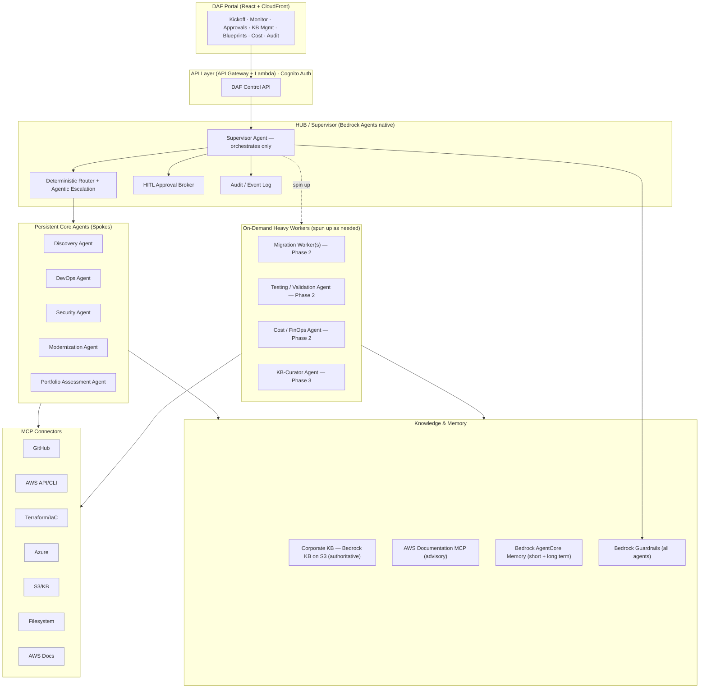
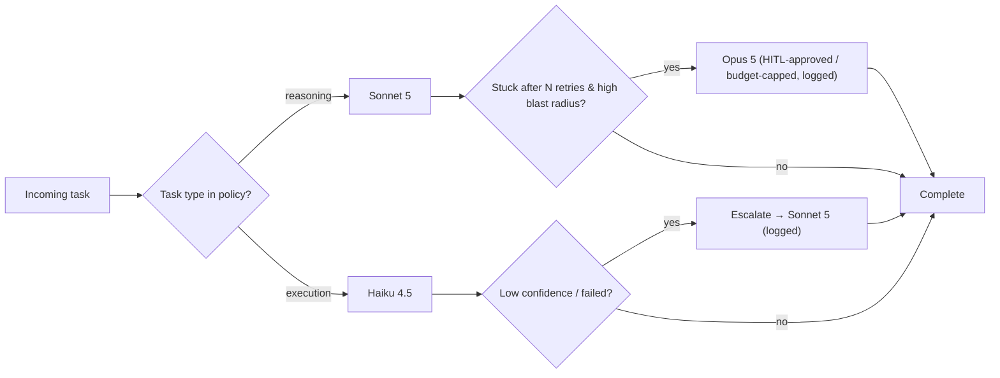
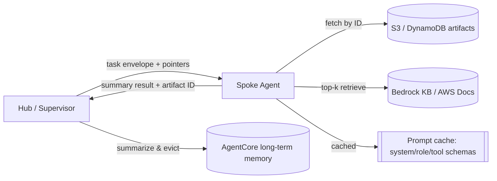
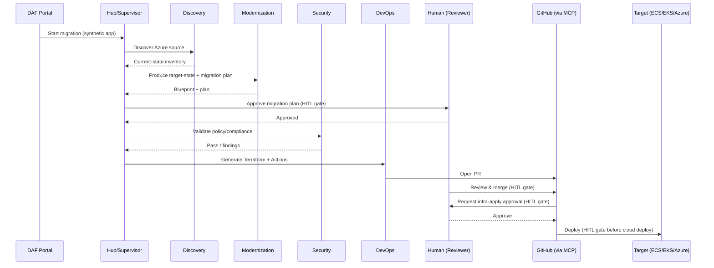

# Dev Agentic Framework (DAF) — Solution Design Document

**Project:** Dev Agentic Framework (DAF) — Non-Production validation of the multi-agent modernization framework
**Relationship:** Dev-environment mirror of TAAF / [WO-022537 In-Scope Framework](../analysis/WO-022537_Design_Document.md) — used to validate the design before any production work.
**Status:** Draft — for design review (design only; phased implementation to follow on approval)
**Date:** 2026-08-20
**Region:** `ap-southeast-2` (Sydney)
**Bedrock account:** `stax-au1-telstra-agentic-framework` (service identity `aiapp-bedrock-svc`)

---

## 1. Purpose

DAF is a **development-environment implementation** of the multi-agent modernization framework. Its goal is to let us **build and validate** the agent topology, model routing, knowledge/memory design, CI/CD integration, and human-in-the-loop (HITL) controls end-to-end against a **synthetic sample application** — proving the pattern safely before it is applied to real or production workloads.

The validation scenario: migrate a synthetic application from **Azure VM / Web App** to AWS (primary: **ECS Fargate**), with the framework also able to redeploy to **EKS** or **back to Azure** depending on the ask (multi-cloud outcome).

**Azure source environment (to be confirmed, Section 14):** the Discovery Agent and Azure MCP connector are designed against a **real, low-cost, non-production Azure subscription** hosting the synthetic app (not a mocked/simulated discovery response), so that Discovery, the Azure MCP connector, and any Azure-redeploy path are validated against live Azure APIs — consistent with proving the pattern "safely before real workloads," not skipping the hardest integration point. This means the Azure SP credential in §12.4 is real (scoped to a disposable subscription/resource group, least-privilege, non-production) and must be provisioned and secured like any other credential in this design, not treated as a placeholder. If a fully simulated Azure source is preferred instead (no live subscription), Discovery/Azure-MCP validation is deferred and this should be called out as an explicit scope reduction — confirm which before Phase 1 kickoff.

## 2. Design Principles

1. **Hub–Spoke.** A central **Hub (Supervisor)** orchestrates work; it *only* spins up and coordinates agents — it never performs migration work itself.
2. **Star communication.** All inter-agent traffic routes through the Hub for a clean audit trail and central control.
3. **Deterministic where it matters, agentic elsewhere.** Deterministic model/task routing by default, with agentic escalation when confidence is low.
4. **Human-in-the-loop for change & review.** Explicit approval gates at every state-changing boundary.
5. **Authoritative corporate knowledge.** The corporate KB in S3 is the source of truth; AWS best-practice sources are advisory and may *suggest a better way* but never override corporate policy without human review.
6. **Pluggable.** Phase 1 uses Bedrock Agents native; the orchestration layer is abstracted so Strands / Step Functions / LangGraph can be swapped in later.
7. **Cost-conscious dev defaults.** Prefer Haiku, serverless/scale-to-zero, on-demand heavy workers, budget alerts.
8. **Multi-cloud aware.** AWS (ECS/EKS) or Azure can be the deployment target.

## 3. High-Level Architecture

**Star rule:** every arrow between agents passes through the Hub. Core agents and workers reach tools via MCP and knowledge via Bedrock KB / AgentCore, but *agent-to-agent handoffs are always brokered by the Supervisor*.

## 4. Agent Catalog

| Agent | Type | Function | Default model |
|---|---|---|---|
| **Hub / Supervisor** | Persistent | Orchestrates only: task decomposition, routing, spin-up, HITL brokering, audit | Sonnet 5 |
| **Discovery Agent** | Persistent | Inventory the Azure source (VM/WebApp, config, deps, data stores), produce current-state | Sonnet 5 (reason) / Haiku (collect) |
| **DevOps Agent** | Persistent | Generate/validate Terraform, CI/CD (GitHub Actions), env provisioning, drift | Haiku (exec), Sonnet on escalation |
| **Security Agent** | Persistent | Policy/compliance checks, isolation/exposure scanning, guardrail validation, audit | Sonnet 5 |
| **Modernization Agent** | Persistent | Code/dependency analysis, target-state blueprint, migration plan | Sonnet 5 |
| **Portfolio Assessment Agent** | Persistent | Categorize app(s) by complexity/risk/value, recommend pathway | Sonnet 5 |
| **Migration Worker(s)** | On-demand *(Phase 2)* | Execute migration steps that deterministic CI/CD can't handle alone — adaptive rollback judgment, multi-target (EKS/Azure) orchestration. *Phase 1 execution is deterministic CI/CD, not an agent — see §7.3.* | Haiku |
| **Testing / Validation Agent** | On-demand *(Phase 2)* | Post-migration smoke/functional/health validation **with reasoning over failures** and escalation. *Phase 1 validation is a scripted smoke-test CI step, not an agent — see §7.3.* | Haiku |
| **Cost / FinOps Agent** | On-demand *(Phase 2)* | Cost estimation/modeling, AWS Budgets integration, portal cost dashboard, reasoning over spend patterns/anomalies. *Phase 1 enforcement is a deterministic token/step/cost-counter hook, not an agent — see §12.1.* | Haiku |
| **PR-Reviewer Agent** | On-demand *(Phase 1)* | Summarize diffs, score risk/blast radius, check KB conformance, focus the human reviewer (comments only, never merges) — advisory layer on top of the deterministic checks in §7.1 | Haiku (Sonnet on complex diffs) |
| **KB-Curator Agent** | On-demand *(Phase 3)* | Draft/curate corporate KB articles (writes gated by HITL) | Sonnet 5 |

## 5. Model Tiering, Selection & Cost Governance

- **Models are configuration, not hardcoded.** A model policy (config table / parameter) maps `task-type → model`; swapping models or Bedrock model IDs requires no code change. AU inference-profile IDs are confirmed (Section 5.0); on-demand access enablement per model in the account is still required before first invocation.
- **Deterministic default:** reasoning-heavy tasks (assessment, blueprinting, security reasoning, planning) → **Sonnet 5**; execution tasks (IaC generation, file ops, deploys, validation) → **Haiku 4.5**.
- **Agentic escalation:** if a task returns low confidence / repeated failure, the Supervisor may escalate it up the ladder (Haiku → Sonnet → Opus). Escalations are the exception and are always logged.

### 5.0 Model IDs (verified against Bedrock in `stax-au1-telstra-agentic-framework`)

Australia has its own **cross-Region inference (CRIS)** geography (Claude Sonnet 4.5/5 and Haiku 4.5 in Japan and Australia — [AWS ML blog](https://aws.amazon.com/blogs/machine-learning/introducing-amazon-bedrock-cross-region-inference-for-claude-sonnet-4-5-and-haiku-4-5-in-japan-and-australia/)); use the **`au.`-prefixed inference profile ID** below, not the bare foundation-model ID, so requests stay within the AU geography.

| Tier | Model | AU inference profile (use this) |
|---|---|---|
| Reasoning | **Sonnet 5** | `au.anthropic.claude-sonnet-5` |
| Execution | **Haiku 4.5** | `au.anthropic.claude-haiku-4-5-20251001-v1:0` |
| Escalation | **Opus 5** | `au.anthropic.claude-opus-5` |

*Confirmed via direct Bedrock query against `stax-au1-telstra-agentic-framework`. On-demand model access still needs to be explicitly enabled per model in the account before first invocation.*

### 5.1 Tiering principle

Match the model to the **cost of being wrong**, not the perceived importance of the task:

- **Haiku 4.5** — high volume, low ambiguity, easily verifiable output; mistakes are cheap and caught by tests/validation.
- **Sonnet 5** — real reasoning, multi-step planning, code/architecture judgment; the workhorse for anything a HITL gate protects.
- **Opus 5** — escalation ceiling only: a wrong answer is expensive **and** Sonnet has demonstrably struggled. Never a default.

> Rule of thumb: if a human HITL gate reviews the output → **Sonnet** is enough (the human is the safety net). If it's mechanical and testable → **Haiku**. If Sonnet genuinely can't and the blast radius is large → **Opus 5**, once, with approval.

### 5.2 Task → model mapping

| Task | Model |
|---|---|
| File ops, formatting, IaC boilerplate, MCP tool calls | **Haiku** |
| Discovery data collection / inventory parsing | **Haiku** |
| Post-migration smoke/health validation | **Haiku** |
| Cost/FinOps calculations | **Haiku** |
| Terraform authoring & review | **Sonnet 5** |
| Modernization blueprint / target-state design | **Sonnet 5** |
| Security & compliance reasoning | **Sonnet 5** |
| Portfolio categorization / pathway recommendations | **Sonnet 5** |
| Hub/Supervisor orchestration & routing | **Sonnet 5** |
| Sonnet failed ≥N times, or high-stakes architecture ambiguity | **Opus 5 (escalation only)** |

### 5.3 Routing model: deterministic default + agentic escalation

- **Deterministic default:** every task is first routed by a fixed `task-type → model` policy (Section 5.2). This is predictable, cheap, and auditable — the same task always starts on the same tier.
- **Agentic escalation:** only when the default tier returns low confidence or fails does the Supervisor *agentically* decide to escalate up the ladder. Escalations are the exception and are always logged.

### 5.4 Escalation ladder & cost controls

- **Ladder, never a default:** Haiku → (low confidence/failure) → Sonnet → (still stuck after N retries) → Opus 5.
- **Opus 5 is gated:** every Opus 5 invocation requires HITL approval **or** stays within a per-run Opus budget (e.g. max 1–2 calls). Enforced by the **Cost/Budget Counter Hook** (Phase 1 deterministic mechanism; promoted to full Cost/FinOps Agent reasoning in Phase 2 — see §12.1).
- **Token discipline > tier:** prompt caching for corporate KB/system prompts; trim context before escalating.
- **Batch cheap work:** Haiku fans out on execution; only synthesis/decision steps go to Sonnet.
- **Measure before upgrading:** log escalation frequency; frequent escalation means fix the prompt/tooling, not the model tier.
- **Target mix** (by call volume for this workload): **~70% Haiku / ~28% Sonnet / <2% Opus**.

### 5.5 Prompt Engineering & Templates

Prompt quality is the lever that makes tiering and token strategy work: a well-structured prompt lets **Haiku** succeed where a sloppy one forces escalation to Sonnet/Opus. Every agent call is assembled from four layers (the first two are static and prompt-cached; the last two vary per call):

1. **System / role layer (static, cached):** agent identity, boundaries, tool allowlist, and a strict **output contract**. E.g. *"You are the DevOps Agent. You only generate Terraform; you never apply. Output valid HCL + a JSON summary."*
2. **Policy layer (static, cached):** corporate guardrails, the "corporate KB authoritative / AWS docs advisory" rule, and HITL reminders.
3. **Retrieved context layer (dynamic, RAG):** top-k KB/doc chunks for *this* task only.
4. **Task envelope (dynamic):** the specific instruction + artifact pointers + acceptance criteria.

**Core techniques:**
- **Role + contract per agent** with an explicit tool allowlist and machine-verifiable **output schema** (JSON/HCL) — structured output means fewer escalations.
- **Deterministic prompts for execution** (low temperature, explicit step list); **plan-then-act / chain-of-thought** allowed only for reasoning tasks.
- **Grounding directive:** answer only from retrieved corporate KB; if KB and AWS docs conflict, follow KB and flag the difference for human review (enforces design principle #5 at the prompt level).
- **Least-context prompting:** reference artifacts by ID and instruct agents to fetch what they need (supports Section 6.4).
- **Self-check rubric before finishing:** reasoning agents verify defined criteria and declare gaps — this drives clean confidence-based escalation.
- **HITL-aware phrasing:** agents emit *"PROPOSED change — pending human approval,"* never asserting completion of gated actions.
- **Injection resistance:** all tool/MCP output and discovered source code are treated as **untrusted data, not instructions** (reinforced by Bedrock Guardrails).

**Governance:** prompt templates are **versioned artifacts** (in the repo), not hardcoded in agent code — tunable, rollback-able, and A/B-tested against escalation-rate metrics. Before upgrading a task's model tier, fix its prompt first (ties to 5.4 "measure before upgrading").

*Phase 1:* ship versioned template artifacts for each core agent (role + contract + policy + grounding + self-check), with prompt caching on layers 1–2.

### 5.6 Prompt Management & Evaluation Tooling

AWS-native first; add lightweight OSS only where Bedrock has gaps.

**Authoring & management**
- **Repo-versioned templates** (Jinja2 / plain) are the source of truth — git-diffable, PR-reviewed.
- Published to **Amazon Bedrock Prompt Management** for versions, variables, and A/B variants without redeploying agents.

**Structural validation (every call)**
- JSON output → **Pydantic / JSON Schema** contracts.
- Terraform output → **`terraform validate` + `tflint` + `checkov`/`tfsec`** (the DevOps agent's real safety net, runs in CI before any HITL gate).
- **Bedrock Guardrails** for safety / PII / injection.

**Quality evaluation (pre-release & regression)**
| Tool | Role |
|---|---|
| **Promptfoo** (OSS, in GitHub Actions) | Prompt **regression tests** + assertions per PR |
| **RAGAS** (OSS) | Corporate-KB **retrieval quality** (faithfulness, context precision/recall) |
| **Amazon Bedrock Evaluations** | Periodic model/prompt **quality gates** (LLM-as-judge + human) |

**Recommended stack:** author in repo → **Bedrock Prompt Management**; validate with **Pydantic + tflint/checkov + Guardrails**; evaluate with **Promptfoo + RAGAS** in CI, plus **Bedrock Evaluations** for periodic gates.

*Phase 1:* Bedrock Prompt Management + **Promptfoo** regression in GitHub Actions + Pydantic/`tflint`/`checkov` validation. RAGAS and Bedrock Evaluations added as the KB and eval corpus mature (Phase 2).

## 6. Knowledge & Memory

### 6.1 Knowledge
- **Corporate KB (authoritative):** Amazon **Bedrock Knowledge Base** backed by **S3**, vector-store backend per Section 6.1.1. This is the corporate guided principle — the source of truth for migration standards.
- **AWS best-practice (advisory):** **AWS Documentation MCP** / `aws-knowledge` retrieval for reference architectures and reasoning. Agents may *advise a better way*, but any deviation from corporate KB is surfaced to a human, never auto-applied.

#### 6.1.1 Vector store: S3 Vectors (Phase 1) vs. OpenSearch Serverless

Design Principle #7 (cost-conscious dev defaults) conflicts with the default vector-store choice implied elsewhere in the wider program (OpenSearch Serverless, per [WO-022537_Design_Document.md §6.2](../analysis/WO-022537_Design_Document.md)): **OpenSearch Serverless carries a fixed floor of roughly $345–700+/month per collection even at zero traffic/idle**, driven by minimum OCU allocation for indexing + search redundancy. For a Phase 1 pilot — one synthetic app, a small seeded KB, scale-to-zero posture — that fixed cost is disproportionate to the workload.

**Phase 1 recommendation: Amazon S3 Vectors** as the Bedrock KB vector backend instead of OpenSearch Serverless. It is natively supported by Bedrock Knowledge Bases, has no idle floor (pay-per-use storage/query), and reduces vector cost by up to ~90% versus OpenSearch Serverless for small-to-mid vector volumes — the right fit for DAF's pilot scale.

- **Phase 1:** Bedrock KB on S3 + **S3 Vectors** backend — cheapest option to validate the agent topology/RAG pattern without paying the OpenSearch idle floor while the pilot is small.
- **Phase 2:** add **OpenSearch Serverless** as a second KB/vector backend to validate *that* path too, since production is expected to run on OpenSearch Serverless (the WO-022537 program default, validated by the CBA precedent in [CBA.md](../docs1/CBA.md)). DAF's purpose is to prove the pattern before production (Section 1) — that includes proving the actual production vector store, not just a cheaper stand-in. Run both backends side by side (or migrate the Phase 1 KB to OpenSearch) to validate retrieval quality/latency parity and surface any Bedrock KB re-indexing or migration steps needed before the production cutover in Phase 3.

### 6.2 Memory
- **Bedrock AgentCore Memory** provides both:
  - **Short-term:** per-session/run conversation + working context.
  - **Long-term:** persistent semantic/summary memory across runs (learned patterns, prior migration outcomes).

### 6.3 Guardrails
- **Bedrock Guardrails** applied to **all** agents: PII redaction, prompt-injection defense, denied topics, and grounding/contextual checks against the corporate KB.

### 6.4 Context & Token Management

In a hub-spoke multi-agent system the token bill is dominated by **context re-transmission**, not the model tier. The following strategy minimizes tokens end-to-end:

1. **Scoped context per spoke (biggest win).** The Hub does *not* forward full history. Each spoke receives only a **task envelope**: `{task, inputs, artifact references, acceptance criteria}`. Large artifacts (source tree, blueprint, tf plan) live in **S3/DynamoDB** and are passed as **pointers/IDs**, not inline — the agent pulls only what it needs.
2. **Retrieval over injection (RAG discipline).** Corporate KB and AWS docs are **retrieved top-k on demand** (e.g. 4–6 chunks) via Bedrock KB / AWS Docs MCP — never pasted wholesale. Grounding stays ~1–2K tokens, not the whole KB.
3. **Prompt caching for static content.** System prompts, agent role instructions, tool/MCP schemas, and stable corporate policy use **Bedrock prompt caching** so they are not re-billed on every call.
4. **Memory as summaries, not transcripts.** AgentCore **short-term** = current run working set only; **long-term** = *summarized* facts/outcomes. Summarize-and-evict when a run closes to keep long-term retrieval lean.
5. **Structured, terse inter-agent messages.** Handoffs are JSON envelopes, not prose; reference an audit-log event ID instead of re-narrating history.
6. **Escalation without replay.** On Haiku→Sonnet→Opus escalation, send a **compact failure summary + the specific artifact**, not the entire prior attempt log.
7. **Right-size the context window.** Cheap execution steps use small context; only reasoning steps (planning/blueprint) get the larger grounded context.
8. **Token budget guardrail.** The **Cost/Budget Counter Hook** (Phase 1) enforces a per-task token ceiling and logs input/output tokens per agent call (same mechanism that caps Opus, §12.1). Over-budget tasks are flagged, not silently ballooned. The full **Cost/FinOps Agent** (Phase 2) adds cost modeling and reasoning over spend patterns on top of this same log.

**Phase 1 context strategy (what we actually turn on first):**
- Task-envelope handoffs with **artifact pointers** (S3/DynamoDB) — no full-history forwarding.
- **RAG top-k** retrieval from the corporate Bedrock KB (tune chunk size + k).
- **Bedrock prompt caching** on system/role prompts and MCP tool schemas.
- AgentCore **short-term** memory for the active run; **summarize-on-close** into long-term.
- **Per-call token logging** via the Cost/Budget Counter Hook (Phase 1 deterministic mechanism, hard caps from day one per §12.1; promoted to the full Cost/FinOps Agent with modeling/dashboards in Phase 2).
- Deferred to later phases: advanced eviction policies, cross-run memory compaction tuning, and multi-target context specialization.

## 7. CI/CD & MCP Integration

- **Pipeline engine:** **GitHub Actions**.
- **Agent flow:** agents author code/IaC and **open Pull Requests via the GitHub MCP**; **humans review & merge**; Actions runs build/deploy.
- **MCP connectors (Phase 1):** GitHub · AWS Documentation · AWS API/CLI · Terraform/IaC · S3/KB · Azure · Filesystem.
- **IaC:** **Terraform** (multi-cloud — AWS and Azure targets).
- **Terraform state backend:** remote state in **S3** (state file, versioned + encrypted with KMS), with **S3-native state locking** (`use_lockfile = true`, Terraform ≥1.11 — no DynamoDB table required) from Phase 1. Required given multiple agents/runs read and write state — without locking, concurrent `terraform apply` runs (e.g. two migration runs, or a run overlapping a manual fix) risk state corruption. One state backend per environment/target (dev, ECS, EKS, Azure) to limit blast radius of a lock/corruption incident.

### 7.1 Automated PR Review & Human Focus

PR review automation does **not** replace the human merge gate (HITL #2) — it filters noise so the human sees only what matters. Two layers:

**Layer 1 — Deterministic checks (block the PR; run before a human looks).**
- `terraform fmt`/`validate`, `tflint`, **`checkov`/`tfsec`**, and `terraform plan` posted as a PR comment.
- Pydantic/JSON-schema validation of agent outputs; unit/smoke tests.
- **Bedrock Guardrails** + secret scanning (e.g. gitleaks) + dependency/CVE scan.
- **OPA/Conftest** policy-as-code enforcing corporate KB rules mechanically (e.g. no public S3, encryption required).

**Layer 2 — PR-Reviewer Agent (advisory; summarizes for the human, never merges).** Posts a structured comment with:
- **Risk score + blast radius** (does the plan add/destroy/replace? touch IAM, networking, data?).
- **Plain-English diff summary**.
- **Corporate-KB conformance** — cites applicable KB rules, flags deviations (grounded in authoritative KB; "better-way" advice clearly labeled).
- **Focus list** — "review these 3 things."
- **Cost delta** — Phase 1: raw Infracost estimate from the Terraform plan (est. monthly $ change); Phase 2: enriched by the full Cost/FinOps Agent once it exists (§12.1).

**Surfacing important things:**
- **Auto-labels** (`high-risk`, `iam-change`, `destroys-resources`, `cost-up`) drive attention and can require an extra reviewer.
- **Required-reviewer routing:** security-relevant diffs auto-attach Security agent findings + request a human security reviewer.
- **Collapse the trivial:** formatting/lockfile/docs-only diffs get a "low-risk" summary to skim.

**Guardrails on the reviewer:** treats the diff as **untrusted data** (injection-resistant), is **read-only** on the repo (comments only), and logs findings to the audit trail. The **merge** and any **destroy/replace or IAM/network change** stay human-approved (HITL gates #2/#3).

*Phase 1:* deterministic checks (Layer 1) + PR-Reviewer Agent summary comment (Layer 2). *Phase 2:* richer risk-routing, required-reviewer automation, and learned risk scoring.

### 7.2 Lifecycle Hooks (Pre/Post)

Hooks are where cross-cutting rules (Guardrails, token budgets, HITL, audit, escalation) are actually enforced. Four layers:

**1. Git / repo hooks** (via `pre-commit`, also enforced in CI so agents can't bypass)
- *Pre-commit:* `terraform fmt`, `tflint`, `checkov`/`tfsec`, `gitleaks`, JSON/YAML lint, Pydantic schema check.
- *Commit-msg:* conventional-commit + DAF run/task ID for audit traceability.

**2. Agent lifecycle hooks (pre/post invocation)** — Hub-enforced, the linchpin
- *Pre-invocation:* inject cached system/policy prompt, attach Guardrails, apply token-budget check, enforce tool allowlist, and **HITL gate check** (block if approval required).
- *Post-invocation:* validate output schema, log tokens + cost (FinOps), write to audit trail, summarize-and-evict into memory, emit escalation signal on low confidence.

**3. Terraform hooks (IaC lifecycle)**
- *Pre-apply:* `plan` + **OPA/Conftest** policy gate + **HITL approval** (gate #1) + cost estimate (Infracost/FinOps).
- *Post-apply:* drift snapshot, outputs to S3/DynamoDB, tag resources with DAF run ID, notify portal.

**4. CI/CD & deploy hooks (GitHub Actions)**
- *Pre-deploy:* image build + scan (Trivy), smoke test, **HITL cloud-deploy gate** (gate #7).
- *Post-deploy:* Testing/Validation agent health/smoke checks; on failure → auto-rollback + notify; on success → update status + audit.

**5. Memory / KB hooks**
- *Post-run:* summarize outcomes → AgentCore long-term memory.
- *KB pre-write:* **HITL gate #5** + schema/format validation before any corporate-KB update.

| Hook | Required? |
|---|---|
| Pre-commit (fmt/lint/secret/policy) | **Required** |
| Agent pre/post-invocation (guardrails, token/cost, audit, HITL, schema) | **Required** |
| Terraform pre-apply (policy + HITL + cost) / post-apply (drift, tag) | **Required** |
| Deploy pre (scan) / post (validate + rollback) | **Required** |
| Memory summarize-on-close, KB pre-write validation | Recommended |
| Commit-msg traceability | Recommended |

*Phase 1:* pre-commit + agent pre/post-invocation + terraform pre-apply/HITL + post-deploy validation. Richer rollback orchestration and learned hooks follow in later phases.

### 7.3 Phase 1 Migration Execution Model: Deterministic-First

Phase 1 delivers a real, working Azure→ECS Fargate migration **without** a Migration Worker or agentic Testing/Validation Agent. This follows the **deterministic-first pattern** already validated for this engagement family in [WO-022537_Design_Document.md §5.6](../analysis/WO-022537_Design_Document.md#56-design-option-deterministic-first-devopssecurity-cba-validated-alternative) (CBA "Lumos" precedent): agents *author* changes, a deterministic pipeline *executes* them, and AI reasoning is reserved for steps that genuinely benefit from it. This is also a direct application of Design Principle #3 (Section 2).

**Phase 1 execution chain (no execution agent required):**
1. **DevOps Agent** (persistent, Sonnet-authored) generates Terraform + GitHub Actions workflow, opens a PR.
2. **Human** reviews and merges (HITL gate #2).
3. **GitHub Actions** deterministically builds the container image, runs `terraform apply` (after HITL gate #1), and deploys to ECS Fargate — no agent in this path, matching Section 7's existing CI/CD design.
4. **A scripted smoke-test CI step** (health endpoint check + basic functional check, not an LLM) gates success/failure and reports back to the Hub for the audit log.
5. On failure, the run halts and raises a HITL alert (Section 12.1) rather than attempting autonomous remediation.

**Why not a Phase 1 Migration Worker / Testing agent:** both would add new agentic scope (reasoning over deploy failures, adaptive retries) before Phase 1 has proven the simpler deterministic path is insufficient. Promoting to an agentic Migration Worker and a reasoning Testing/Validation Agent is deferred to Phase 2, and is justified only if deterministic CI/CD proves inadequate for multi-target (EKS/Azure) orchestration or nuanced rollback decisions — see Phase 2 roadmap (Section 13).

## 8. Human-in-the-Loop Gates

Approval required before:
1. Any infrastructure apply (`terraform apply` / resource creation)
2. PR merge to `main`
3. Any production-affecting / destructive action
4. Spinning up on-demand heavy worker agents (cost control)
5. Writing/updating the corporate KB
6. Finalizing the migration plan / target-state blueprint
7. Deploying to a cloud (AWS or Azure)

Gates are brokered by the Hub's **HITL Approval Broker** and surfaced in the portal; every decision is written to the audit log.

## 9. DAF Portal

- **Capabilities:** kick off/configure a migration run · live agent-run monitoring (status, logs, handoffs) · action HITL approvals · KB management (upload/curate) · discovery report & target-state blueprint viewer · cost/usage dashboard · audit trail.
- **Stack:** **React SPA** on **S3 + CloudFront**, **API Gateway + Lambda** backend, **Cognito** auth.

## 10. Environment & Accounts

- **Phase 1:** single account `stax-au1-telstra-agentic-framework` hosts Bedrock, compute (ECS Fargate), S3 KB, portal, DynamoDB, memory.
- **Later phase:** cross-account compute; **Bedrock remains in `stax-au1`**.
- **Region:** `ap-southeast-2` everything. Note: Claude Sonnet 5 / Haiku 4.5 / Opus 5 on Bedrock in Australia are served via **cross-Region inference (CRIS)**, not a direct `ap-southeast-2` model endpoint — request routing crosses AU regions under the covers (AU-CRIS, consistent with the parent TAAF design). Data residency implications should be confirmed against corporate policy before Phase 1 sign-off; this does not block the design but should be explicit.
- **Cost:** cost-conscious defaults (Haiku-first, scale-to-zero, on-demand workers, AWS Budgets alerts); no hard ceiling yet.

## 11. Security & Isolation

- Least-privilege IAM per agent role; Supervisor holds only spin-up/orchestration permissions (cannot perform migration actions itself).
- All Bedrock calls pass through Guardrails.
- No dev resources exposed to the public internet beyond the authenticated portal (CloudFront + Cognito).
- Full audit log of agent actions and human approvals.

## 12. Reliability, Observability & Agent Safety

These are the cross-cutting foundations that make an autonomous multi-agent system safe to run. Sections 12.1–12.4 are **Phase 1 critical**; 12.5–12.6 are **Phase 2** (see Section 13 roadmap).

### 12.1 Runaway-agent controls & kill switch

Autonomous agents can loop, over-spend, or take unintended actions — hard limits and an emergency stop are mandatory, not optional.

**Cost/Budget Counter Hook (Phase 1 mechanism — not an agent).** The safety claims below are backed in Phase 1 by a lightweight, deterministic hook, not by the Cost/FinOps Agent (which is Phase 2 — see Section 4 and 13). It increments counters per agent invocation from Bedrock response metadata (input/output tokens, wall-clock, step count) and checks them against **hardcoded per-run ceilings**, pre- and post-invocation. No cost modeling, forecasting, or dashboard — just counting and threshold-checking, which is sufficient to make the hard-cap and kill-switch claims below true from day one. Phase 2 promotes this to the full **Cost/FinOps Agent**: cost estimation/modeling, AWS Budgets integration, portal cost dashboard, and reasoning over spend anomalies — layered on top of the same counters, not replacing them.

- **Per-run budgets (hard caps):** max total tokens, max $ spend, max wall-clock time, and **max agent steps / tool calls** per run. Breaching a cap **halts the run** and raises a HITL alert (not a silent continue). Enforced by the **Cost/Budget Counter Hook** above (same mechanism that caps Opus, Section 5.4) — live from Phase 1, not deferred to the Phase 2 agent.
- **Loop / no-progress detection:** the Hub tracks repeated identical tool calls or state with no forward progress and aborts with a diagnostic.
- **Global kill switch:** a portal control + API that immediately **stops the Hub and drains/cancels all spokes and on-demand workers**, releasing compute. Backed by a `run-state` flag every agent hook checks pre-invocation.
- **Per-agent circuit breaker:** N consecutive tool/agent failures trip the breaker for that agent and surface to the human instead of retrying forever.

### 12.2 Observability & tracing

Audit log answers *what was approved*; tracing answers *what actually happened and why*.

- **Distributed tracing** of every run across Hub → spokes → tools/MCP → models, correlated by a single **DAF run/trace ID** (propagated in every task envelope and audit event).
- **Stack:** OpenTelemetry instrumentation → **CloudWatch / X-Ray** (AWS-native), with **Bedrock AgentCore Observability** for agent-level spans; optional Langfuse for prompt/trace inspection.
- **Metrics:** per-agent latency, token/cost, escalation rate, tool error rate, HITL wait time, cache-hit rate — surfaced on the portal cost/monitor dashboards.
- **Structured logs** (JSON) with the trace ID so a failed migration can be reconstructed end-to-end.

### 12.3 Orchestration durability & failure handling

Migrations are long-running and multi-step; a mid-run failure must not corrupt state or silently strand resources.

- **Durable run state:** each run's step graph + status persisted (DynamoDB / Step Functions state) so a run is **resumable** after a transient failure rather than restarted.
- **Idempotency:** every agent/tool action carries an idempotency key; re-execution after retry does not double-apply (critical for `terraform apply`, deploys, KB writes).
- **Retries with backoff** on transient tool/model/throttle errors; **dead-letter** capture for steps that exhaust retries.
- **Compensation / saga:** partially-applied migration steps have a defined rollback (e.g. `terraform destroy` of the just-applied module, deregister task) so a failed run leaves a clean state; destructive compensation still passes the relevant HITL gate.
- **Checkpointing:** artifacts + step outputs written to S3/DynamoDB at each boundary so work isn't lost on restart.

### 12.4 Agent identity, secrets & tool authorization

- **Identity per agent:** each agent/worker runs under its **own least-privilege IAM role** (not a shared role); the Supervisor role cannot perform migration actions.
- **Secrets:** all credentials (GitHub token, Azure SP, registry creds) live in **AWS Secrets Manager**, injected at tool-call time — **never** placed in prompts, context, memory, or logs (Guardrails + secret scanning enforce this).
- **GitHub Actions → AWS auth:** the deploy pipeline (Section 7) authenticates via **GitHub OIDC federation to a scoped IAM role** — no long-lived AWS access keys stored as Actions secrets. The federated role is restricted (trust policy scoped to the specific repo/branch/workflow) and limited to only the actions the pipeline needs (image push to ECR, `terraform apply` on the DAF state backend, ECS service update); it is a distinct role from any agent's IAM identity above.
- **MCP / tool authorization:** each MCP server has a **scoped credential and a runtime allowlist**; an agent can only call the tools its role permits (enforced in the pre-invocation hook, not just by prompt).
- **MCP supply-chain trust:** only vetted/pinned MCP server versions; treat all MCP output as untrusted data (Section 5.5 injection resistance).

### 12.5 Sandboxed execution of agent-generated code

- Agent-authored build/migration code runs in an **ephemeral, isolated sandbox** (short-lived Fargate task / CodeBuild) with **no production credentials**, **egress-controlled** networking, and auto-teardown — so generated code can be built/tested without risk to the framework or targets.

### 12.6 Networking & data-plane isolation

- **VPC** with private subnets for compute; **PrivateLink / VPC endpoints** for Bedrock, S3, Secrets Manager, ECR so traffic stays off the public internet.
- **Egress control** (endpoint policies / egress proxy) on agent and sandbox compute.
- **Encryption everywhere:** TLS in transit; KMS at rest for S3 (KB + artifacts), DynamoDB, memory store.

## 13. Phased Implementation Roadmap

> Design-only today. Implementation proceeds **phase-wise** on your approval of each phase.

### Phase 1 — Foundations & Single-App Validation
- Bedrock model enablement (Sonnet 5, Haiku 4.5, Opus 5) + Guardrails in `stax-au1`.
- Corporate KB (Bedrock KB on S3 + **S3 Vectors** backend, §6.1.1) + a **sample KB article** seeded.
- Hub/Supervisor (Bedrock Agents native) + persistent core agents (Discovery, DevOps, Security, Modernization, Portfolio).
- MCP connectors wired (GitHub, AWS Docs, AWS API/CLI, Terraform, S3/KB, Azure, Filesystem).
- Terraform remote state backend (S3 with native state locking, §7) provisioned before any agent-authored `terraform apply`.
- GitHub Actions → AWS via **OIDC federation** to a scoped IAM role (§12.4) — no long-lived keys in Actions secrets.
- AgentCore Memory (short + long term).
- Context/token strategy (Section 6.4): task-envelope handoffs with artifact pointers, RAG top-k, prompt caching, summarize-on-close, per-call token logging.
- HITL broker + audit log.
- Synthetic sample app + migrate Azure→**ECS Fargate**, executed via the **deterministic CI/CD path** (DevOps Agent authors → PR → human merge → GitHub Actions builds/deploys → scripted smoke test), per §7.3 — no Migration Worker or agentic Testing/Validation Agent in Phase 1.
- Deterministic PR checks (§7.1 Layer 1: fmt/validate/tflint/checkov, schema validation, secret scan) + **PR-Reviewer Agent** (§7.1 Layer 2: advisory risk/diff summary comment) ahead of the human merge gate.
- Minimal portal (kickoff, monitor, approvals).
- **Agent safety (Section 12):** Cost/Budget Counter Hook + per-run hard caps + kill switch (12.1 — deterministic mechanism, not the Phase 2 Cost/FinOps agent), OpenTelemetry→CloudWatch/X-Ray tracing with run-ID correlation (12.2), durable/resumable run state + idempotency + retries (12.3), per-agent IAM roles + Secrets Manager + tool allowlist (12.4).

#### Phase 1 Success Criteria

Phase 1's purpose (Section 1) is to prove the pattern before it's applied to real workloads — that claim needs a falsifiable definition of "proven," not just a features-delivered checklist. Proposed measurable criteria, to be confirmed before Phase 1 kickoff and re-baselined once real usage data exists (ties to the "per-run hard-cap values" open item, Section 14):

| Dimension | Target (proposed) |
|---|---|
| **End-to-end outcome** | Synthetic app migrated Azure→ECS Fargate via the §7.3 deterministic path, passing the scripted smoke test, with zero manual intervention outside the defined HITL gates |
| **Model routing mix** | Actual call-volume mix within range of the ~70/28/2 Haiku/Sonnet/Opus target (Section 5.4); material deviation triggers a routing-policy review, not a silent tolerance |
| **Escalation rate** | Haiku→Sonnet escalation rate logged as a baseline (no target yet — Phase 1's job is to establish it); Sonnet→Opus escalations ≤ budgeted cap (Section 5.4) |
| **HITL turnaround** | Time from HITL request raised to human decision, logged per gate (Section 8) — establishes baseline for Phase 2 SLA definition (Section 14 open item) |
| **Cost per run** | Total $ (model + infra) for one full migration run, logged via the Cost/Budget Counter Hook (§12.1) — establishes baseline; no ceiling yet per Section 10 |
| **Safety mechanisms exercised** | Kill switch, per-run hard caps, and circuit breaker (§12.1) each deliberately triggered at least once in a test run and confirmed to halt/alert correctly — a control that's never been tested isn't a control |
| **Audit completeness** | 100% of agent actions and HITL decisions traceable end-to-end via the run/trace ID (§12.2) — spot-checked by reconstructing one full run from the audit log alone |

**Phase 1 is considered successful** if the migration completes end-to-end via the deterministic path, all seven HITL gates (Section 8) function as designed, the safety mechanisms above are confirmed functional (not just present), and cost/escalation baselines are captured for Phase 2 planning. It does **not** require hitting a specific cost or time target yet — Phase 1's job is to establish the baseline those targets will be set against.

### Phase 2 — Full Portal & Multi-Target
- Complete portal (KB mgmt, blueprint viewer, cost dashboard, audit trail).
- EKS and **Azure redeploy** targets.
- Promote Phase 1's deterministic CI/CD execution (§7.3) to on-demand agentic workers (Migration Worker, Testing/Validation) + agentic escalation — justified by multi-target (EKS/Azure) orchestration needs and/or evidence that deterministic CI/CD is insufficient for rollback decisions.
- Promote Phase 1's Cost/Budget Counter Hook (§12.1) to the full Cost/FinOps Agent: cost estimation/modeling, AWS Budgets integration, portal cost dashboard, spend-anomaly reasoning.
- Stand up **OpenSearch Serverless** as the Bedrock KB vector backend alongside S3 Vectors (§6.1.1), since production is expected to run on OpenSearch Serverless — validates the actual production vector store, not just the Phase 1 cost-saving stand-in.
- **Sandboxed execution** of agent-generated code (12.5) + **VPC/PrivateLink networking & KMS encryption** (12.6).
- **Saga/compensation rollback** for partially-applied migration steps (12.3).
- **Framework testing strategy:** golden-task suites, simulation/replay, integration + failure-injection (chaos) tests for the multi-agent system itself.
- **Human notification & approval SLAs:** SNS/Slack/email notifications, approval expiry/timeout behavior, RBAC on who can approve each gate.
- **Concurrency & Bedrock throttling:** rate-limit handling, backpressure, parallel-run caps.
- **Data management:** data classification of discovered app data (PII/secrets), retention policy, artifact provenance.

### Phase 3 — Hardening & Extensibility
- KB-Curator agent (gated writes) + "better-way" advisory workflow.
- Pluggable orchestration abstraction (Strands / Step Functions / LangGraph swap).
- Cross-account compute topology (Bedrock stays in `stax-au1`).
- **Agent/prompt versioning & registry** + canary rollout of new agent versions.
- **Multi-tenancy isolation model** for the production path (tenant boundary, data + compute isolation).
- **Audit immutability/retention** (WORM / retention lock) for compliance.
- **Feedback loop:** capture human corrections/approvals to improve agents, prompts, and long-term memory over time.
- **Non-functional targets (NFRs):** latency, throughput, and availability objectives for the framework.
- Production-readiness review before any prod use.

## 14. Open Items / Assumptions

- Synthetic sample app stack to be generated in Phase 1 (proposed: stateless web API + small managed DB).
- **Azure source environment:** confirm whether the synthetic app runs on a real non-production Azure subscription (validates Discovery + Azure MCP against live APIs, per Section 1) or is fully simulated (defers that validation) — affects Azure SP credential provisioning (§12.4) and Phase 1 scope.
- Bedrock model access for Sonnet 5 / Haiku 4.5 / Opus 5 (AU inference profile IDs confirmed, Section 5.0): enable on-demand access per model in `stax-au1-telstra-agentic-framework`, and confirm AU-CRIS data-residency posture satisfies corporate policy before Phase 1 sign-off.
- GitHub org/repo for the pipeline to be confirmed.
- Corporate KB article format/schema to be confirmed with the seeded sample.
- **Per-run hard-cap values** (max tokens/$/steps/time) to be set once baseline usage is observed.
- **Approval SLAs & approver RBAC** — who approves each HITL gate and what happens on timeout (revisit, Phase 2).
- **Data classification & retention policy** for discovered source-app data (may contain PII/secrets) — to be defined (Phase 2).
- **Multi-tenancy isolation model** for the production path — to be designed before prod (Phase 3).
- **Audit retention/immutability** requirement (WORM period) to be confirmed with compliance.
- **NFR targets** (latency/throughput/availability) to be agreed for the framework.
- **MCP server versions/trust list** to be pinned and vetted.
