# Telstra AWS Agentic Framework (TAAF) — Executive Summary Review

**Source:** `Telstra_AWS_Agentic_Framework_TAAF_v03_ExecSum_.pdf`
**Date on deck:** May 2026 | **Prepared by:** AWS Telstra Account Team
**Classification:** Amazon Confidential / AWS-Telstra NDA material

> This review reconstructs the deck's text and diagrams into Markdown. Page images are embedded (rendered from the PDF at 150dpi, stored in `assets/taaf_pages/`) since most of the content is diagram-driven rather than prose.

---

## 1. What are we solving (p.2)

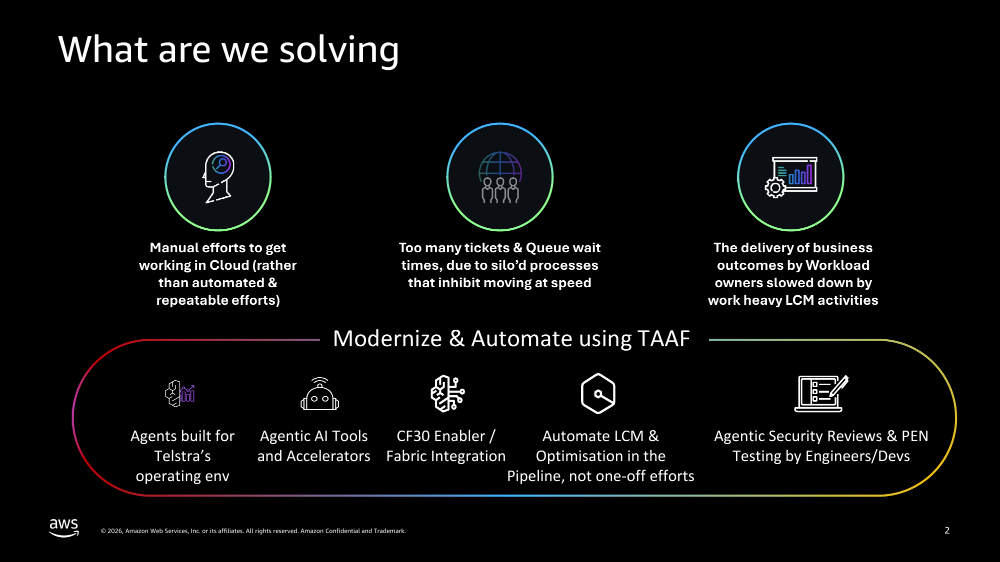

Three core problems at Telstra today:
- **Manual efforts to get working in Cloud** — rather than automated & repeatable efforts
- **Too many tickets & queue wait times** — due to siloed processes that inhibit moving at speed
- **Business outcomes delayed** — Workload owners slowed down by work-heavy Lifecycle Management (LCM) activities

**Proposed response — "Modernize & Automate using TAAF"**, via five levers:
1. Agents built for Telstra's operating environment
2. Agentic AI tools and accelerators
3. CF30 Enabler / Fabric integration
4. Automate LCM & optimisation in the pipeline (not one-off efforts)
5. Agentic security reviews & penetration testing performed by engineers/devs

---

## 2. TAAF Flow (p.3)

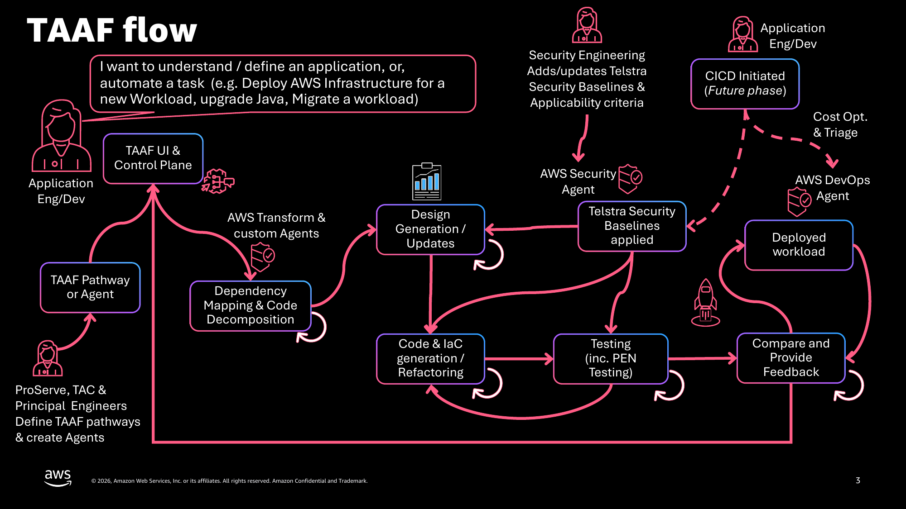

End-to-end operating flow:
1. **ProServe, TAC & Principal Engineers** define TAAF pathways and create agents.
2. An **Application Engineer/Dev** raises a request (e.g. "deploy AWS infra for a new workload", "upgrade Java", "migrate a workload") via the **TAAF UI & Control Plane**, selecting a **TAAF Pathway or Agent**.
3. **Dependency Mapping & Code Decomposition** (AWS Transform + custom agents) →
4. **Design Generation / Updates**, informed by **Telstra Security Baselines** (maintained by Security Engineering and enforced via the **AWS Security Agent**) →
5. **Code & IaC Generation/Refactoring** → **Testing (incl. PEN testing)** → **Compare and Provide Feedback** (self-correcting loop back into code generation) →
6. **AWS DevOps Agent** handles cost optimisation & triage, feeding a (future-phase) **CI/CD** trigger →
7. Results in a **Deployed Workload**, which loops feedback back to the Design/Baseline stage.

---

## 3. Why do this — Transformation Impact preview (p.5)

Slide shows a **Before/After comparison banner** ("Manual & Constrained" vs. "Agentic & Self-Service"), citing real data from the **Afterburner Security Agent trial** at Telstra. (Full detail expanded later on p.21 — see §12.)

---

## 4. Deployment Timeline (p.6)

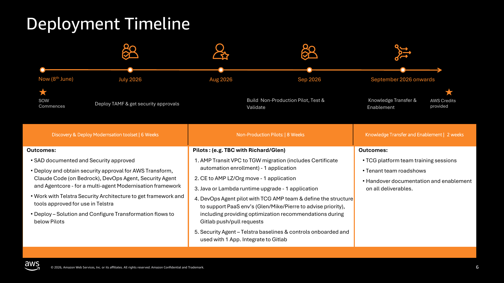

| Phase | Duration | Key Outcomes |
|---|---|---|
| **Discovery & Deploy Modernisation Toolset** | 6 weeks (Now, 8 June → July 2026) | SAD documented & security approved; deploy/obtain approval for AWS Transform, Claude Code (on Bedrock), DevOps Agent, Security Agent, AgentCore; work with Telstra Security Architecture to get framework/tools approved; configure transformation flows for pilots |
| **Non-Production Pilots** | 8 weeks (Aug–Sep 2026) | 1. AMP Transit VPC→TGW migration (+ certificate automation) — 1 app; 2. CE→AMP LZ/Org move — 1 app; 3. Java or Lambda runtime upgrade — 1 app; 4. DevOps Agent pilot with TCG AMP team (PaaS optimisation recs on GitLab push/pull); 5. Security Agent pilot — Telstra baselines onboarded & used on 1 app, integrated to GitLab |
| **Knowledge Transfer & Enablement** | 2 weeks (Sep 2026 onward) | TCG platform team training sessions; tenant team roadshows; handover documentation & enablement on all deliverables |

AWS Credits are provided to offset costs during this period.

---

## 5. Estimated Costs (p.7)

- AWS Credits will offset TAAF component usage until at least **31 Nov 2026**.
- Estimated ongoing cost (TBC in pilots): **$250–$550 per pathway executed** (after credits are exhausted).

---

## 6. Suggested Next Steps (p.8)

1. Richard/Glen confirm the desired pilots (by **13th May**)
2. AWS to send draft SOW (by **15th May**)
3. Amend PCF SOW to use remaining budget and get moving quickly:
   - Resource onboarding, access & laptops can start using the existing PCF SOW
   - SAD generation (AMP account setup & security approvals) to use remaining PCF SOW funds
4. Get TAAF SOW approved & work continues (by **8th June**)

> Note: TAAF SOW won't invoice until July/August, so ProServe costs and credits would both land in **FY27**.

---

## 7. AWS ProServe Scope & Timeframe — Deployment SOW Summary (p.10-11)

This proposal outlines the engagement plan for deploying, securing, and operationalising a multi-agent Modernisation framework within Telstra, leveraging **AWS Transform, Claude Code or Kiro, Amazon Bedrock AgentCore, Enterprise AI Hub, and Accelerator Hub**, plus Security/DevOps agents. Includes non-production pilots across key Modernisation use cases, concluding with knowledge transfer & enablement.

**Key Outcomes:**
- **Modernisation Platform Operational** — AWS Transform, Claude Code/Kiro, Bedrock AgentCore (multi-tenant), Enterprise AI Hub deployed, security-approved, production-ready, with App/Cloud discovery and New Relic NLQ observability integration
- **Non-Production Pilots Validated** — 4 pilots executed & validated (AMP Transit VPC→TGW migration; CE→AMP LZ/Org move; Java/Lambda runtime upgrade; DevOps/Security agent pilot) with documented outcomes and test results
- **Gen AI Accelerated to Production** — Accelerator Hub deployed with 1–2 key Gen AI use cases built and promoted to production
- **Multi-Agent Framework Proven** — Security and DevOps agents configured, piloted, validated within the multi-agent Modernisation framework
- **Self-Sufficiency Achieved** — platform team trained, tenant teams enabled via roadshows, complete handover documentation delivered

---

## 8. Telstra AWS Modernisation Framework — Opportunity, Team & Scope (p.12)

**Opportunity:** Empower Modernisation at scale for Telstra using a multi-agent, self-service capability to drive efficiency and enhance security/governance on existing and future applications.

**The Big Idea:**
- Shift from point-in-time modernisation efforts to framework-based approaches
- Deploy extensible & reusable toolsets to solve multiple problems
- Focus on repeatable patterns rather than one-off activities
- Use modernisation SoW as the vehicle to implement solution capabilities
- Deliver shared team workspaces within TAAF for collaboration and reuse of Gen AI use cases

**Teams:**
- **AWS Team:** Cloud/Network Architects, Application Modernisation Specialists, DB Modernisation Specialists, Security Specialist, AI/ML Engineers
- **Telstra Team (part-time):** AMP & CE Engineers, Application Engineers (pilot apps), Security Architect, Gen AI Engineers

**RACI (proposed):** Squads made up of AWS Modernisation Tech Lead, Cloud Architects, DevOps Specialists, Gen AI Engineers/Architects, Governance & Security, a Modernisation support vendor (e.g. Versent) for Modernisation/AI-ML use cases, Telstra Infra SME for assessment tool deployment, and the Telstra Gen AI/AIML team.

**Scope:**
- Deploy & obtain security approval for AWS Transform, Claude Code/Kiro, AgentCore (multi-tenant), Security/DevOps agents configured with a multi-agent modernisation framework (similar to the [CBA implementation shared at re:Invent 2025](https://www.youtube.com/watch?v=H02dc_AV_Vo))
- DevOps integration with New Relic (chatbot-style NLQs into observability)
- Security agent pilot
- Co-develop validation criteria with Telstra
- Deploy Gen AI workspaces for team collaboration
- Deploy Bedrock AgentCore
- Program governance

**Non-Production Pilots:**
- AMP Transit VPC→TGW migration (incl. certificate automation enrolment) — 1 application
- CE to AMP LZ/Org move — 1 application
- Java or Lambda runtime upgrade — 1 application
- DevOps and Security agent pilot

**Knowledge Transfer & Enablement:** TCG platform team training sessions; tenant team roadshows; handover documentation & enablement on all deliverables.

**Key Dependencies:**
- AWS account access & required IAM permissions provisioned by TCG within Week 1–2
- Security approval timelines are best-effort; delays in Telstra security review may impact Phase 3 (existing Bedrock & Claude Code on Bedrock approvals should help fast-track)
- Pilot applications pre-identified or confirmed no later than end of Week 2
- New Relic environment available with appropriate API access for DevOps agent integration
- Non-production environments available and representative of production
- TCG will provide dedicated points of contact for each pilot workstream

---

## 9. Delivery Phases & Effort (p.13)

Four-phase delivery timeline (table content was degraded in text extraction; reconstructed below):

| Phase | Duration | Focus |
|---|---|---|
| Kick off, Discovery & Planning | Weeks 1–2 | Alignment, access, baselining |
| Assessment & Design | Weeks 3–6 | (design/assessment activities) |
| Deployment & Validation | Weeks 7–14 | Build, pilot, test & validate |
| KT & Handovers | Weeks 15–16 | Knowledge transfer & enablement |

**Phase 1 — Kick off, Discovery & Planning (Weeks 1-2)**
- *Activities:* ProServe kicks off project & deep-dives on enablers/dependencies; establish project governance, communication cadence & RACI; gain access to environments, tooling, documentation; baseline current state of target applications, infrastructure, security posture
- *Outcomes:* Detailed delivery plan (dependencies, milestones, showcases); Discovery Report — current state (Applications, Cloud, AI/ML landscape, dependencies); identification of Telstra process/governance approvals that may impact delivery; high-level success criteria; Environment Access & Readiness Checklist; Gen AI Use Case Shortlist (1–2 selected for Accelerator Hub)
- *Telstra effort:* Application Owner 25% (review/approval); Security Architect 25–50% (review/approval)

---

## 10. TAAF Agentic Framework — Expected Benefits (p.14)

Section banner: *"Empowering Telstra teams to modernise, secure and operate workloads on AWS — faster and with fewer dependencies"* (refer to appendix for details — see §12–13, §16).

---

## 11. A New Way of Working (p.16)

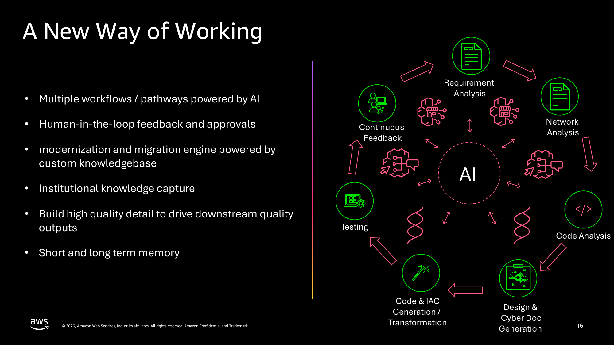

Principles:
- Multiple workflows/pathways powered by AI
- Human-in-the-loop feedback and approvals
- Modernisation and migration engine powered by a custom knowledgebase
- Institutional knowledge capture
- Build high-quality detail to drive downstream quality outputs
- Short and long term memory

**Diagram — Continuous AI-driven lifecycle** (circular flow around a central "AI" hub):
`Requirement Analysis → Network Analysis → Code Analysis → Design & Cyber Doc Generation → Code & IaC Generation/Transformation → Testing → Continuous Feedback` (loops back to Requirement Analysis).

---

## 12. Secure Deployment Architecture Overview (p.17)

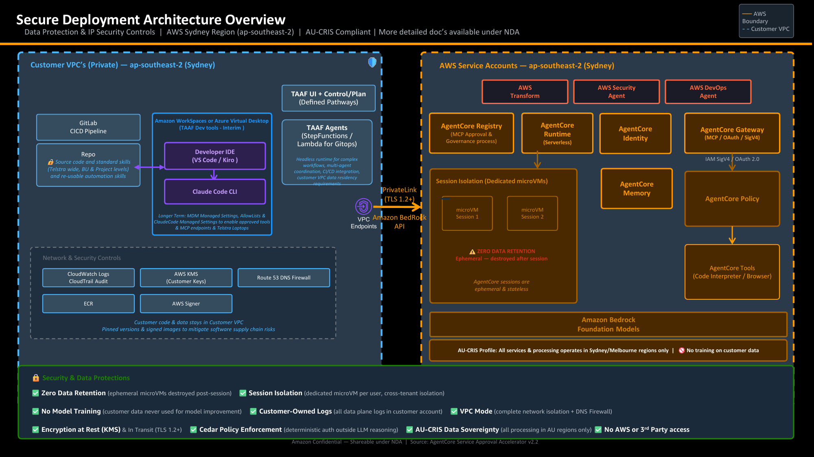

Region: **AWS Sydney (ap-southeast-2)**, **AU-CRIS compliant**. Two zones:

**Customer VPC (Private):**
- GitLab CI/CD Pipeline → Repo (source code, standard skills, reusable automation — Telstra-wide/BU/Project levels)
- Developer IDE (VS Code / Kiro) → Claude Code CLI, accessed via Amazon WorkSpaces or Azure Virtual Desktop (interim TAAF dev tools); longer-term: MDM managed settings, allow-lists, Claude Code managed settings for approved tools/MCP endpoints on Telstra laptops
- TAAF UI + Control/Plan (defined pathways)
- TAAF Agents (Step Functions/Lambda for GitOps) — headless runtime for complex workflows, multi-agent coordination, CI/CD integration, customer VPC data-residency requirements
- Network & Security Controls: CloudWatch Logs/CloudTrail Audit, AWS KMS (customer keys), Route 53 DNS Firewall, ECR, AWS Signer — customer code & data stays in customer VPC; pinned versions & signed images mitigate supply-chain risk
- Connects to AWS side via **PrivateLink (TLS 1.2+)** / VPC Endpoints to Amazon Bedrock API

**AWS Service Accounts (ap-southeast-2):**
- AWS Transform, AWS Security Agent, AWS DevOps Agent
- **AgentCore**: Registry (MCP approval & governance), Runtime (serverless), Identity, Gateway (MCP/OAuth/SigV4), Memory, Policy, Tools (Code Interpreter/Browser)
- **Session Isolation** — dedicated microVMs per session; ⚠️ zero data retention, ephemeral & stateless, destroyed after session
- Amazon Bedrock Foundation Models — AU-CRIS profile: all processing in Sydney/Melbourne only, no training on customer data

**Security & Data Protections (highlighted):**
✅ Zero Data Retention (ephemeral microVMs destroyed post-session) · ✅ Session Isolation (dedicated microVM per user, cross-tenant isolation) · ✅ No Model Training · ✅ Customer-Owned Logs (all data-plane logs in customer account) · ✅ VPC Mode (complete network isolation + DNS firewall) · ✅ Encryption at Rest (KMS) & in Transit (TLS 1.2+) · ✅ Cedar Policy Enforcement (deterministic auth outside LLM reasoning) · ✅ AU-CRIS Data Sovereignty · ✅ No AWS or 3rd-party access

*Source: AgentCore Service Approval Accelerator v2.2*

---

## 13. Telstra AWS Modernisation Framework — Tool Stack (p.18)

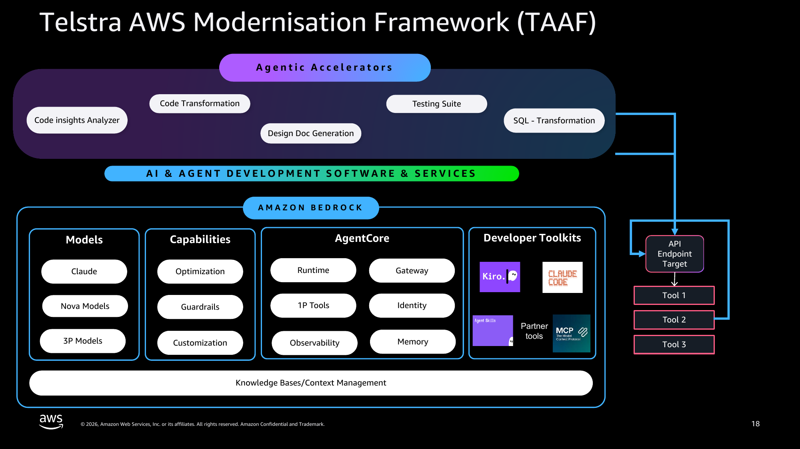

Layered architecture:
- **Agentic Accelerators** (top layer): Code Insights Analyzer, Code Transformation, Design Doc Generation, Testing Suite, SQL Transformation
- **AI & Agent Development Software & Services**
- **Amazon Bedrock**, containing:
  - **Models:** Claude, Nova Models, 3P Models
  - **Capabilities:** Optimization, Guardrails, Customization
  - **AgentCore:** Runtime, 1P Tools, Observability, Gateway, Identity, Memory
  - **Developer Toolkits:** Kiro, Claude Code, Agent Skills, Partner tools, MCP
  - **Knowledge Bases/Context Management** (foundation layer)
- Right-hand flow: Bedrock connects via an **API Endpoint Target** to external **Tool 1 / Tool 2 / Tool 3**

---

## 14. Agentic AI-powered Application Modernization (p.19)

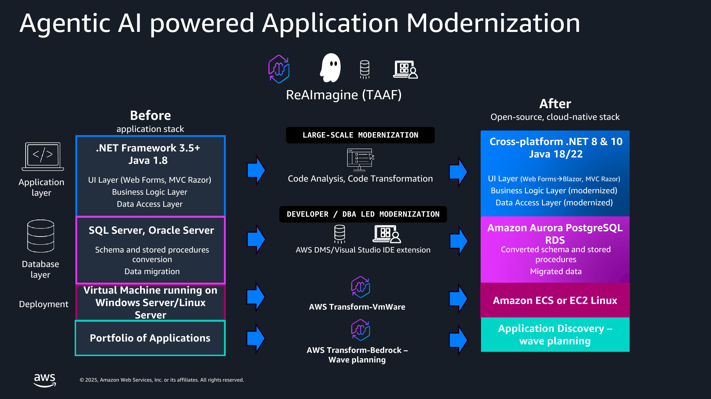

**Before → ReAImagine (TAAF) → After**, across 4 layers:

| Layer | Before | TAAF Process | After |
|---|---|---|---|
| Application | .NET Framework 3.5+ / Java 1.8 (UI: Web Forms/MVC Razor, Business Logic, Data Access) | Code Analysis, Code Transformation (large-scale modernization) | Cross-platform .NET 8 & 10 / Java 18/22 (UI: Blazor/MVC Razor, modernized BLL & DAL) |
| Database | SQL Server, Oracle Server (schema/SP conversion, data migration) | AWS DMS / Visual Studio IDE extension (developer/DBA-led modernization) | Amazon Aurora PostgreSQL RDS (converted schema/SPs, migrated data) |
| Deployment | VM on Windows Server/Linux Server | AWS Transform – VMware | Amazon ECS or EC2 Linux |
| Portfolio | Portfolio of Applications | AWS Transform – Bedrock (wave planning) | Application Discovery – wave planning |

---

## 15. Transformation Impact — Before vs. After (p.21)

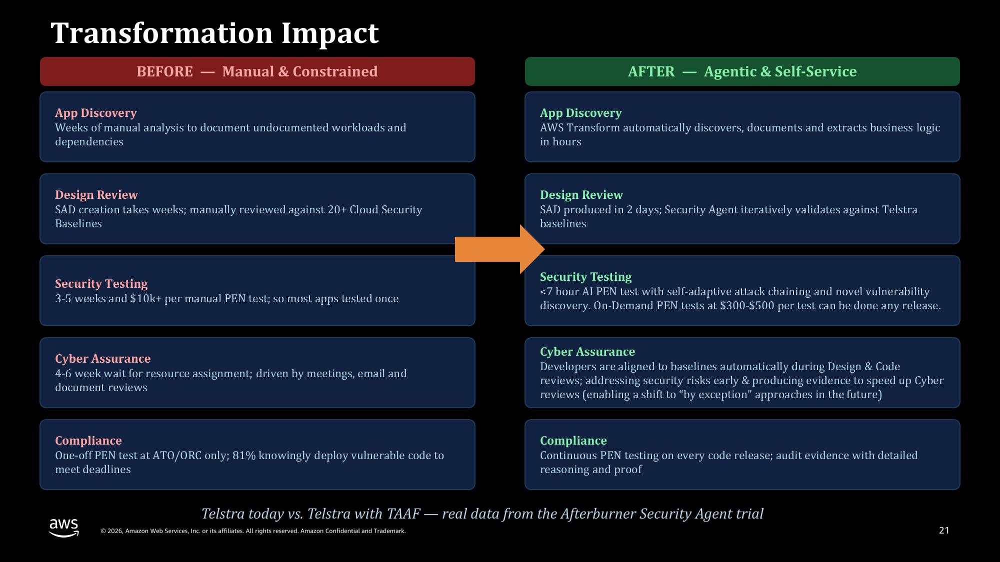

| Area | BEFORE — Manual & Constrained | AFTER — Agentic & Self-Service |
|---|---|---|
| App Discovery | Weeks of manual analysis to document undocumented workloads/dependencies | AWS Transform automatically discovers, documents & extracts business logic in hours |
| Design Review | SAD creation takes weeks; manually reviewed against 20+ Cloud Security Baselines | SAD produced in 2 days; Security Agent iteratively validates against Telstra baselines |
| Security Testing | 3–5 weeks and $10k+ per manual PEN test; most apps tested once | <7hr AI PEN test with self-adaptive attack chaining & novel vulnerability discovery; on-demand tests at $300–$500, any release |
| Cyber Assurance | 4–6 week wait for resource assignment; driven by meetings/email/doc reviews | Developers auto-aligned to baselines during design & code review; addresses security risks early, produces evidence to speed reviews (enabling future "by exception" approaches) |
| Compliance | One-off PEN test at ATO/ORC only; 81% knowingly deploy vulnerable code to meet deadlines | Continuous PEN testing on every code release; audit evidence with detailed reasoning & proof |

*Real data from the Afterburner Security Agent trial.*

---

## 16. AWS Security Agent — Telstra Afterburner Trial Results (p.22)

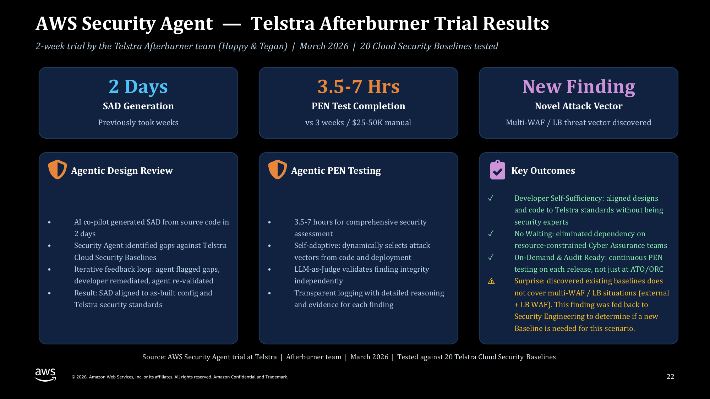

2-week trial by the Telstra Afterburner team (Happy & Tegan), March 2026, 20 Cloud Security Baselines tested.

**Headline metrics:**
- **2 Days** — SAD generation (previously took weeks)
- **3.5–7 Hrs** — PEN test completion (vs. 3 weeks / $25–50K manual)
- **New Finding** — Novel attack vector: multi-WAF/LB threat vector discovered

**Agentic Design Review:** AI co-pilot generated SAD from source code in 2 days; Security Agent identified gaps vs. Telstra Cloud Security Baselines; iterative feedback loop (agent flags gaps → developer remediates → agent re-validates); result: SAD aligned to as-built config and Telstra security standards.

**Agentic PEN Testing:** 3.5–7 hours for comprehensive security assessment; self-adaptive (dynamically selects attack vectors from code and deployment); LLM-as-judge validates finding integrity independently; transparent logging with detailed reasoning/evidence per finding.

**Key Outcomes:**
- ✅ Developer self-sufficiency — aligned designs/code to Telstra standards without being security experts
- ✅ No waiting — eliminated dependency on resource-constrained Cyber Assurance teams
- ✅ On-demand & audit-ready — continuous PEN testing on each release, not just at ATO/ORC
- ⚠️ Surprise finding: existing baselines don't cover multi-WAF/LB situations (external + LB WAF); fed back to Security Engineering to assess whether a new baseline is needed

---

## 17. Modernisation: Challenges vs. Benefits (p.23)

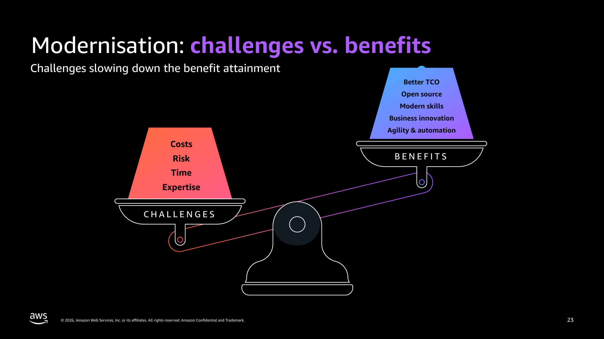

Balance-scale diagram — **Challenges** (Costs, Risk, Time, Expertise) weigh down vs. **Benefits** (Better TCO, Open source, Modern skills, Business innovation, Agility & automation).

---

## 18. Why now? What changed? (p.24)

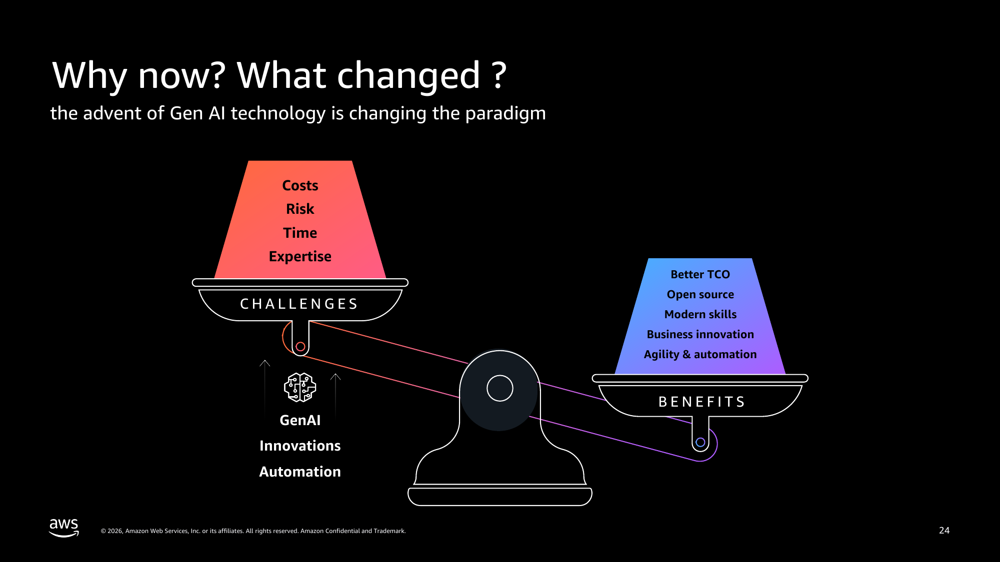

Same challenges/benefits scale as above, but with **GenAI Innovations & Automation** shown tipping the balance toward Benefits — i.e., Gen AI is the catalyst that shifts the cost/benefit equation in modernisation's favour.

---

## 19. Modernisation & Ongoing Optimisation — TCO (p.25)

Typical TCO comparison stepping through: On-premises → Lift & shift (~15% reduction) → Right-sizing / DR & Labs (additional 15–20% reduction) → Improved elasticity, measure/monitor/improve, optimized EC2, storage optimization, serverless architecture, managed services → **True AWS-optimized (65%+ reduction or more)**.

> Cost optimisation & removal of 3rd-party licenses is framed as a journey, not a one-off event.

---

## 20. Closing (p.26)

"Thank you!" — closing slide.

---

## Notes on this conversion

- Full text was extracted programmatically (`pdf2md`); several slides are diagram/graphic-heavy with little embedded text, so page images were rendered (`pdftoppm`, 150dpi) and are referenced above for the diagram-heavy slides (pp. 2, 3, 6, 16–19, 21–24).
- Rendered page images are stored under [assets/taaf_pages/](assets/taaf_pages/) as `page-01.png` … `page-26.png`.
- Slides 1, 4, 9, 15, 20 are title/section-divider slides with minimal content and are omitted from the detailed sections above.
- This document is derived from AWS/Telstra confidential material — handle per the confidentiality notice on the original deck (Amazon Confidential, NDA-governed).
