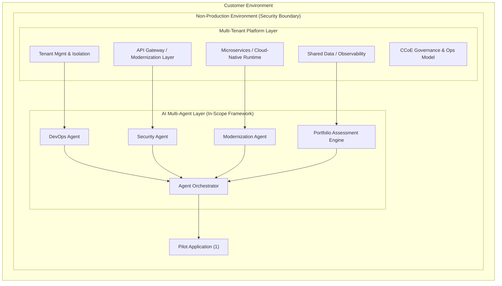
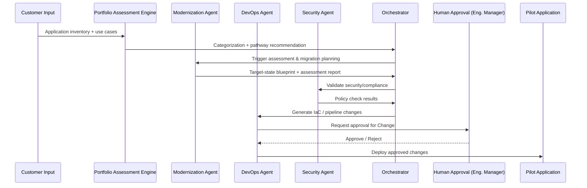
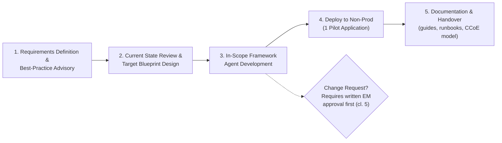

# WO-022537 — In-Scope Framework: Solution Design Document

**Project:** Multi-Tenant AI-Enabled Modernization Platform ("In-Scope Framework")
**Work Order Ref:** WO-022537 | MSA ID# CC MASM 00009595 2018 TR
**Parties:** AWS (Client) / Versent Pty Ltd (Delivery Partner)
**Document Status:** Draft — for internal design review
**Date:** 2026-07-29

---

## 1. Purpose

This document describes the proposed technical design for the AI-driven, multi-agent modernization platform ("In-Scope Framework") required under Work Order WO-022537. It translates the contractual requirements (see [WO-022537_Requirements_Summary.md](WO-022537_Requirements_Summary.md)) into an architecture, technology stack, and delivery approach, and expands on the diagrams in [WO-022537_Architecture.drawio](WO-022537_Architecture.drawio).

## 2. Background & Objective

AWS has engaged Versent to design, build, and pilot an AI-powered framework that helps a Customer assess, plan, and modernize its application portfolio. Rather than a traditional one-off migration engagement, the goal is to build a **reusable, agent-driven modernization capability** — piloted against one (1) application in the Customer's non-production environment — and hand over the framework, documentation, and operating model so the Customer can run it independently going forward.

## 3. Scope Summary

- Define modernization requirements & AWS best-practice guidance for a multi-tenant, AI-integrated platform
- Design and deploy GenAI-enabled modernization patterns (assessment, migration planning, lifecycle automation)
- Review current-state architecture and produce target-state blueprints (microservices, API modernization, cloud-native patterns)
- Deploy multi-agent components (DevOps, Security, Application Modernization agents) into Customer's non-prod environment
- Deploy against one (1) pilot application
- Produce documentation deliverables (implementation guide, architecture diagrams, runbooks, portfolio assessment framework, CCoE operating model)

*(Full contractual detail in [WO-022537_Requirements_Summary.md](WO-022537_Requirements_Summary.md))*

## 4. High-Level Architecture

Reference diagram: **WO-022537_Architecture.drawio → "In-Scope Framework - Target State"** tab (full editable version). Simplified view below:

| Layer | Purpose |
|---|---|
| Multi-Tenant Platform Layer | Tenant isolation, API/modernization gateway, microservices runtime, shared data/observability, CCoE governance |
| AI Multi-Agent Layer | DevOps, Security, Application Modernization agents, Portfolio Assessment engine — coordinated via an orchestrator |
| Pilot Scope | The one (1) application modernized end-to-end as proof of concept |
| Non-Production Security Boundary | All deployment/testing confined to non-prod; no AWS Information made internet-accessible (contract clause 4.1) |

## 5. AI Agent Design

### 5.1 DevOps Agent
- **Function:** IaC generation/validation, CI/CD pipeline automation, environment provisioning, drift monitoring
- **Tools:** AWS CLI/SDK, Git operations, pipeline trigger APIs, telemetry/log queries
- **Guardrail:** All infrastructure-impacting changes require human-in-the-loop approval before execution (aligned to contract clause 5 — written Engagement Manager approval for Changes)

### 5.2 Security Agent
- **Function:** Policy/compliance checks against AWS Provider Security Policy, access/isolation boundary enforcement, internet-exposure scanning, audit logging
- **Guardrail:** Read-mostly by default; any remediation action requires escalation/approval, not autonomous execution

### 5.3 Application Modernization Agent
- **Function:** Code/dependency analysis, modernization pattern matching (microservices, API, cloud-native), migration plan generation, lifecycle automation
- **Output:** Target-state blueprint + application assessment report, subject to mutual AWS/Customer review before finalization

### 5.4 Portfolio Assessment Engine
- **Function:** Ingests application inventory, applies AI-powered categorization (complexity, risk, business value) informed by Customer-selected use cases, generates modernization pathway recommendations
- **Output:** Application Portfolio Assessment Framework (contractual deliverable)

### 5.5 Orchestration Layer
- Coordinates agent hand-offs (sequential + supervisor pattern), maintains shared context/state across agents, and routes outputs to human approval gates where required.

### 5.6 Design Option: Deterministic-First DevOps/Security (CBA-Validated Alternative)

Based on the AWS re:Invent 2025 CBA "Lumos" case study (see [CBA.md](CBA.md)), an alternative — and arguably lower-risk — framing for the DevOps Agent and Security Agent is available as an option to consider alongside Sections 5.1/5.2 above:

- **DevOps:** instead of an autonomous agent independently making infrastructure decisions, keep a **deterministic deployment platform/pipeline** (IaC templates, CI/CD, approval gates) as the actual execution layer. AI is used to **generate parameters/config/IaC drafts** that feed into that pipeline, with every infra-impacting action still routed through human review + Engagement Manager approval (clause 5).
- **Security:** instead of a fully autonomous reasoning agent making live security judgment calls, implement security compliance as **hardcoded guardrails/policy-as-code** (deny internet-facing resources, enforce IAM boundaries, block AWS Information exposure) — deterministic, testable, auditable. AI is layered on top only for tasks that benefit from reasoning (interpreting scan results, summarizing risk, generating security documentation/threat tables), not for making enforcement decisions itself.
- **Rationale:** CBA's production implementation pairs deterministic engines (static analyzers, policy-as-code, OpenRewrite) with AI for exactly this reason — it reduces hallucination risk, provides an auditable/provable compliance story, and is a better fit for a contract with explicit security clauses (4.1/4.2) and a formal Change-approval requirement (clause 5).
- **Where full agentic autonomy remains appropriate:** the Application Modernization Agent (5.3) and Portfolio Assessment Engine (5.4) are lower blast-radius (advisory output, PR-gated code changes) and can retain fuller agentic autonomy as originally designed.

This option does not replace Sections 5.1/5.2 — it is presented as an alternative implementation approach to evaluate during solution design, informed by a proven real-world precedent.

## 6. AI/ML Technology Approach

### 6.1 Foundation Models
- Model selection per task: lightweight/cheap model for classification (portfolio categorization), stronger reasoning model for architecture/migration planning
- AWS-native preference: **Amazon Bedrock** for model access, given the AWS Professional Services context and security requirements (avoids AWS Information leaving AWS-managed boundaries)

### 6.2 Retrieval-Augmented Generation (RAG)
RAG is required to ground agent outputs in Customer-specific reality (code, architecture docs, current-state configuration) rather than generic LLM knowledge:
- **Knowledge sources:** application code repos, architecture/design docs, current infra configuration, security policies
- **Implementation option:** Amazon Bedrock Knowledge Bases (native) with OpenSearch/vector store, or a custom embeddings + vector DB pipeline if more control is needed
- **Chunking strategy:** separate strategies for code (function/module-level) vs. prose documentation (semantic/paragraph-level)

### 6.3 Agent Orchestration Framework
- Not contractually mandated — implementation choice. Options evaluated:
  - **Amazon Bedrock Agents** (native, keeps everything in-AWS boundary — preferred default)
  - **LangGraph / LangChain** or **CrewAI** — viable if more complex multi-agent orchestration logic is needed beyond native Bedrock Agents
- **Recommendation:** Start with Bedrock Agents + Knowledge Bases for the pilot; introduce LangGraph only if orchestration complexity (e.g., conditional branching across agents) exceeds native capability.

### 6.4 Guardrails & Safety
- **Bedrock Guardrails** (or equivalent) for content filtering, PII redaction, and preventing unsafe/destructive tool calls
- Hard rule: no agent action that could make AWS Information internet-accessible (contract clause 4.1) — enforced via network/IAM boundaries, not just prompt instructions
- All infrastructure/security-impacting actions require human-in-the-loop sign-off before execution

### 6.5 LLMOps / Observability
- Full tracing/logging of agent decisions and tool calls (feeds the Runbooks deliverable and supports troubleshooting)
- Automated evaluation pipeline for prompt/agent regression testing
- Drift monitoring for output quality as underlying models are updated

## 7. Security & Compliance Considerations

| Requirement | Design Response |
|---|---|
| No AWS Information internet-accessible (cl. 4.1) | Agents/tools deployed within private VPC boundaries; Security Agent actively scans for exposure |
| AWS Provider Security Policy compliance (cl. 4.2) | Security Agent policy module checks against current policy; reviewed periodically as policy updates |
| No subcontracting/delegation without authorization (cl. 4.3) | Delivery team composition controlled directly by Versent; no further subcontracting of agent development |
| Change control (cl. 5) | All Changes (including agent behavior changes affecting scope) require written Engagement Manager approval prior to implementation |

## 8. Delivery Approach

Reference diagram: **WO-022537_Architecture.drawio → "Engagement & Delivery Process Flow"** tab.

1. Requirements definition & AWS best-practice advisory
2. Current-state review & target-state blueprint design (quantity mutually agreed with Customer)
3. In-Scope Framework agent development (DevOps, Security, Modernization, Portfolio Assessment)
4. Deployment to non-production environment against the one (1) pilot application
5. Documentation & handover (implementation guide, runbooks, CCoE operating model)

Engagement management, time/expense tracking, and invoicing run through **PSA Communities** per the commercial terms (weekly entry, AWS validation, invoicing within 60 days).

## 9. Team & Skills Required

- **Cloud/Architecture:** AWS Well-Architected patterns, microservices, API modernization, multi-tenant design
- **AI/GenAI Engineering:** prompt engineering, RAG/embeddings, agentic tool-use design, multi-agent orchestration, guardrails/safety, LLMOps
- **Application Modernization:** portfolio assessment methodology, migration planning (6 Rs), DevOps/CI-CD
- **Security & Governance:** cloud security frameworks, CCoE operating model design
- **Resourcing (per contract):** Principal Engineer, Principal Consultant, Staff Consultant — 3,000 hours total, capped at $761,840 AUD

*(Full complexity/skills discussion available in prior session Q&A — not duplicated here.)*

## 10. Deliverables Mapping

| Deliverable (contractual) | Design Component Producing It |
|---|---|
| Implementation guide | Section 8 delivery approach + agent configuration docs |
| Architecture diagrams | Section 4 + accompanying `.drawio` file |
| Runbooks | Section 6.5 observability/logging + agent operational procedures |
| Application Portfolio Assessment Framework | Section 5.4 Portfolio Assessment Engine |
| CCoE operating model documentation | Section 4 governance layer + role/process definitions (to be developed with Customer) |

## 11. Open Items / Assumptions

- Exact foundation model(s) and orchestration framework to be confirmed during solution design workshops with Customer
- Number of target-state blueprints "to be mutually agreed between AWS and Customer" — not yet finalized
- CCoE deliverable content was truncated in the source contract document — confirm full scope with AWS/Customer before finalizing governance design
- Clause 4.3(a) (subcontracting restriction) text was truncated in source — confirm full clause before finalizing team/subcontractor plan

---
**Related documents:**
- [WO-022537_Requirements_Summary.md](WO-022537_Requirements_Summary.md) — extracted contractual requirements
- [WO-022537_Architecture.drawio](WO-022537_Architecture.drawio) — architecture diagrams (6 tabs: overview, agent details, process flow)
