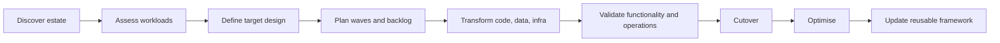

# AI Assisted Migration Framework

## Purpose

Get the team started on building a **cloud-agnostic AI assisted migration framework** that can be reused across customer migration programs.

This page is a working hub for ideation, migration phases, design, end-to-end flow, AI tooling, timeline, and codebase tracking.

## Outcomes

- Define a repeatable migration framework that is cloud agnostic.
- Identify where AI can accelerate assessment, planning, transformation, testing, cutover, and optimisation.
- Establish an end-to-end migration flow that teams can apply consistently.
- Track framework design decisions, tooling options, proof-of-concepts, code repositories, and delivery timeline.

## Workstreams

| Workstream | Goal | Status | Notes |
| --- | --- | --- | --- |
| --- | --- | ---: | --- |
| Ideation | Capture use cases, principles, assumptions, and target customers/workloads | Not started |  |
| Migration phases | Define reusable phases and entry/exit criteria | Not started |  |
| Solution design | Design reference architecture and operating model | Not started |  |
| End-to-end flow | Map the complete migration lifecycle from discovery to optimisation | Not started |  |
| AI tooling | Identify AI tools, agents, prompts, automations, and guardrails | Not started |  |
| Codebase tracking | Track repositories, sample apps, accelerators, scripts, and reusable assets | Not started |  |
| Timeline | Plan milestones, demos, reviews, and delivery checkpoints | Not started |  |

## Guiding principles

- **Cloud agnostic by design:** support AWS, Azure, GCP, hybrid, and multi-cloud patterns.
- **Framework first, tooling second:** define the migration method before locking into tools.
- **Human-in-the-loop:** AI should assist, not blindly automate critical migration decisions.
- **Traceable decisions:** every recommendation should have context, assumptions, and evidence.
- **Reusable assets:** prompts, scripts, templates, code, and playbooks should become accelerators.
- **Security and compliance by default:** include data handling, access control, auditability, and risk review.

## Migration phases

### 1. Discover

**Objective:** understand the current estate, application landscape, dependencies, and constraints.

**Activities**

- Inventory applications, infrastructure, data stores, integrations, and environments.
- Identify ownership, business criticality, usage patterns, and SLAs.
- Analyse dependencies across apps, networks, databases, APIs, queues, batch jobs, and third-party services.
- Capture source cloud/on-prem details and target constraints.

**AI assistance opportunities**

- Summarise discovery documents and architecture diagrams.
- Extract application inventory from CMDB exports, spreadsheets, repositories, and documentation.
- Detect dependency candidates from code, config, logs, and infrastructure-as-code.
- Generate discovery interview questions and workshop summaries.

**Outputs**

- Application inventory
- Dependency map
- Current-state architecture
- Initial migration complexity assessment

### 2. Assess

**Objective:** determine migration suitability, risks, target disposition, and prioritisation.

**Activities**

- Assess each workload against 6R / 7R migration options: rehost, replatform, refactor, repurchase, retire, retain, relocate.
- Evaluate cloud readiness, technical debt, compliance constraints, cost drivers, and operational risk.
- Group workloads into migration waves.

**AI assistance opportunities**

- Recommend migration disposition based on evidence.
- Summarise risks and assumptions.
- Identify refactoring candidates from code and architecture patterns.
- Compare cloud target services across AWS, Azure, and GCP.

**Outputs**

- Workload assessment
- Migration disposition recommendations
- Risk register
- Prioritised migration backlog

### 3. Design

**Objective:** define the target-state architecture and migration approach.

**Activities**

- Create target landing zone assumptions and integration patterns.
- Define identity, network, observability, security, backup, DR, and deployment patterns.
- Design application, data, and integration migration approaches.
- Define rollback, cutover, and validation strategies.

**AI assistance opportunities**

- Generate reference architecture options.
- Review designs against Well-Architected-style principles.
- Produce architecture decision records.
- Map source technologies to cloud-agnostic patterns and cloud-specific implementations.

**Outputs**

- Target-state architecture
- Migration design
- Security and compliance considerations
- Architecture decision records

### 4. Plan

**Objective:** convert the migration approach into an executable delivery plan.

**Activities**

- Break down work into epics, features, tasks, and migration waves.
- Estimate effort, skills, sequencing, and dependencies.
- Define environments, test plans, governance, and reporting cadence.
- Create delivery timeline and milestones.

**AI assistance opportunities**

- Generate migration runbooks and task plans.
- Create acceptance criteria and test scenarios.
- Identify sequencing risks and missing dependencies.
- Draft stakeholder updates and governance packs.

**Outputs**

- Migration roadmap
- Wave plan
- Delivery backlog
- Test and validation plan

### 5. Transform

**Objective:** make the required code, infrastructure, data, and configuration changes.

**Activities**

- Refactor or replatform application code where required.
- Build infrastructure-as-code and deployment pipelines.
- Update configuration, secrets, endpoints, integrations, and observability.
- Prepare data migration and synchronisation mechanisms.

**AI assistance opportunities**

- Code analysis and refactoring assistance.
- Generate infrastructure-as-code scaffolding.
- Convert deployment scripts and configuration.
- Create tests, mocks, and validation scripts.
- Explain legacy code and generate technical documentation.

**Outputs**

- Updated application code
- Infrastructure-as-code
- CI/CD pipelines
- Data migration scripts
- Technical documentation

### 6. Validate

**Objective:** prove the migrated workload works functionally, operationally, and securely.

**Activities**

- Run functional, integration, performance, security, resilience, and operational tests.
- Compare source and target behaviour.
- Validate data integrity and observability.
- Confirm support model and operational readiness.

**AI assistance opportunities**

- Generate and expand test cases.
- Analyse test failures and logs.
- Compare source and target outputs.
- Summarise readiness gaps and defect trends.

**Outputs**

- Test evidence
- Defect register
- Operational readiness checklist
- Go/no-go recommendation

### 7. Cutover

**Objective:** move production traffic or operations to the target environment safely.

**Activities**

- Execute cutover runbook.
- Coordinate change windows, communications, and approvals.
- Monitor cutover progress, rollback criteria, and live issues.
- Confirm production validation.

**AI assistance opportunities**

- Generate cutover runbooks.
- Monitor and summarise logs, alerts, and deployment status.
- Draft live status updates.
- Assist with incident triage and rollback decision support.

**Outputs**

- Cutover plan
- Live migration status
- Production validation evidence
- Rollback or completion decision

### 8. Optimise

**Objective:** improve performance, reliability, cost, security, and maintainability after migration.

**Activities**

- Review performance, cost, reliability, and operational metrics.
- Tune infrastructure, application settings, scaling, and observability.
- Capture lessons learned and reusable assets.
- Feed improvements back into the framework.

**AI assistance opportunities**

- Analyse cost and performance trends.
- Recommend optimisation actions.
- Generate post-migration reports.
- Identify reusable patterns and accelerators.

**Outputs**

- Optimisation backlog
- Benefits tracking
- Lessons learned
- Updated framework assets

## End-to-end migration flow

### Initial view

## AI tools and usage points

| Migration point | AI capability | Candidate tools | Guardrails |
| --- | --- | --- | --- |
| Discovery | Summarisation, extraction, dependency detection | GitHub Copilot | Validate extracted facts with owners |
| Assessment | Disposition recommendation, risk analysis | LLM-assisted assessment templates, architecture review prompts | Require evidence and human approval |
| Design | Architecture options, ADR generation, pattern mapping | diagramming tools ?? | Review by architects/security |
| Planning | Backlog generation, estimation support, runbook drafting | planning agents (Jira ROVO) | Treat estimates as draft only |
| Transformation | Code refactoring, IaC generation, config conversion | GitHub Copilot?? | Code review, tests, security scans |
| Validation | Test generation, log analysis, defect triage | GitHub Copilot | Maintain deterministic test evidence |
| Cutover | Runbook assistant, status updates, incident triage | ChatOps agents | Human-controlled execution |
| Optimisation | Cost/performance analysis, recommendations | FinOps Agent | Confirm recommendations before changes |

## Codebase and asset tracking

| Asset | Location | Owner | Purpose | Status |
| --- | --- | --- | --- | --- |
| Framework repository | TBD | TBD | Core framework, templates, scripts, examples | Not started |
| Prompt library | TBD | TBD | Reusable migration prompts and agent instructions | Not started |
| Assessment templates | TBD | TBD | Discovery and workload assessment templates | Not started |
| Reference architectures | TBD | TBD | Cloud-agnostic and cloud-specific architecture patterns | Not started |
| Sample application | TBD | TBD | Test bed for migration flow and tooling | Not started |
| IaC modules | TBD | TBD | Reusable deployment patterns | Not started |
| Runbooks | TBD | TBD | Migration, validation, and cutover procedures | Not started |

## Initial timeline

| Timeframe | Milestone | Target outputs |
| --- | --- | --- |
| Week 1 | Ideation and scope | Problem statement, principles, candidate use cases, success criteria |
| Week 2 | Framework outline | Migration phases, end-to-end flow, draft templates |
| Week 3 | Tooling review | AI tooling matrix, selection criteria, guardrails |
| Week 4 | Prototype design | Reference architecture, sample workload, repo structure |
| Weeks 5–6 | Proof of concept | Discovery-to-transform flow tested against sample codebase |
| Week 7 | Validation and packaging | Test evidence, runbooks, reusable assets |
| Week 8 | Playback and next steps | Demo, lessons learned, backlog for capability uplift |

## Decisions to make

- Which initial workload or sample application should be used for the proof of concept?
- Which clouds should be included in the first version of the cloud-agnostic framework?
- What repository structure should be used for framework assets?
- Which AI tools are approved or preferred for code analysis and transformation?
- What security, privacy, and customer data guardrails are required?
- What does “good enough” look like for the first internal version?

## Open questions

- Who should be part of the core working group?
- Do we want this to become a reusable Versent capability/playbook?
- Should the first proof of concept focus on app migration, data migration, infrastructure migration, or full-stack migration?
- How will we measure time saved, quality improvement, risk reduction, and repeatability?
- Where should source discovery artefacts, generated outputs, and reusable assets be stored?

## Next steps

- [ ]  Confirm core team and working group.
- [ ]  Agree initial scope and target use case.
- [ ]  Select sample application or customer-like workload.
- [ ]  Create repository for framework assets.
- [ ]  Draft discovery and assessment templates.
- [ ]  Define AI tooling shortlist and guardrails.
- [ ]  Create first migration flow prototype.
- [ ]  Schedule playback/demo checkpoint.